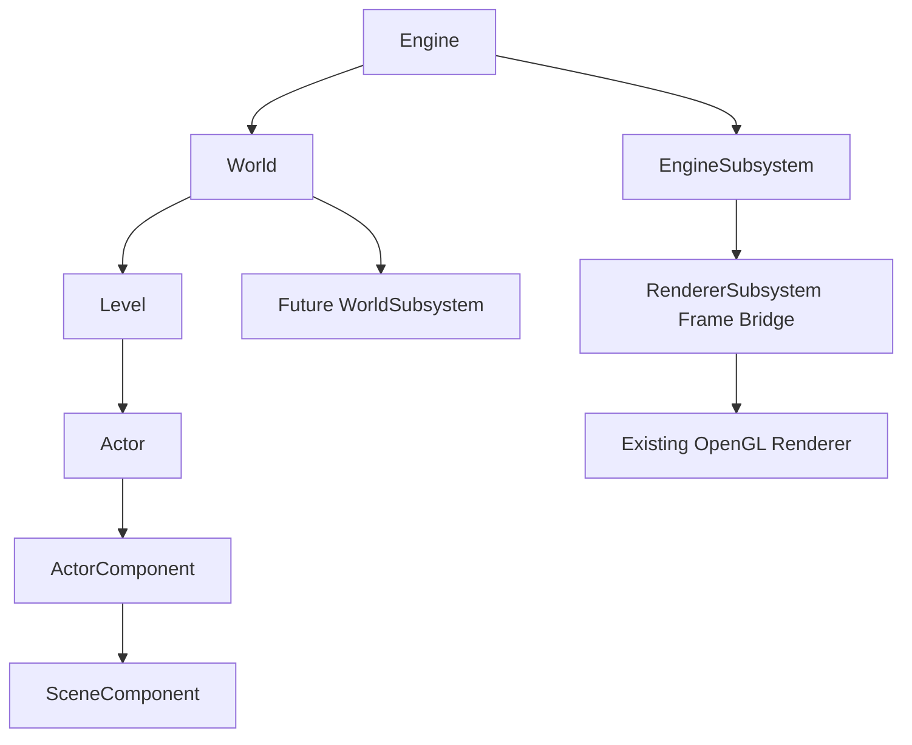

# UE5 启发式引擎框架项目书

## 文档定位

本文是后续引擎化改造的总入口。根据最新方向，项目不再按“renderer wrapper + Entity 数据容器”的方案推进，而是向 UE5 的框架层次靠拢。

这里的“UE5 启发式”不是复刻 UE5，也不是引入 UE5 源码概念的复杂度，而是采用它的核心组织方式：

- Engine 管生命周期。
- World 承载运行中的世界。
- Level 组织场景分块。
- Actor 是可放置、可更新、可拥有组件的对象。
- Component 是行为与空间能力的组合单元。
- Subsystem 承载跨 World 或跨 Engine 的服务。
- Renderer 是 Engine 的一个系统，而不是整个项目本身。

当前状态：

```text
Autonomous execution
```

用户已明确要求本阶段暂不再等待审核，完成自主设计后开始推进。

## 当前判断

之前的文档把项目向 `Engine -> Module -> Entity / Asset / Renderer / Editor` 推进，这个方向虽然可行，但仍偏“数据驱动 renderer 外壳”。当前目标应提高一层：先建立类似 UE5 的 gameplay framework 骨架，再逐步把现有 renderer 放进框架中。

关键修正：

- 不以 `EntityId + ComponentStorage` 作为第一主线。
- 不把 `RenderWorldSnapshot` 作为当前最核心接口。
- 不以 renderer pipeline 的边界作为引擎架构中心。
- 第一阶段先落 `Engine / World / Level / Actor / ActorComponent / SceneComponent / EngineSubsystem`。

## 框架目标



## 第一阶段目标

第一阶段只建立框架骨架，不接管现有启动流程：

- 新增 `engine/` 目录。
- 新增最小 `EngineObject`，提供对象 ID 和名称。
- 新增 `Engine`，提供 initialize / tick / shutdown。
- 新增 `World`，提供 beginPlay / tick / endPlay。
- 新增 `Level`，拥有 Actor 列表。
- 新增 `Actor`，拥有 Component 列表。
- 新增 `ActorComponent` 和 `SceneComponent`。
- 新增 `EngineSubsystem`，为后续 Renderer / Asset / Editor subsystem 留口。
- 注册 Visual Studio 工程文件。
- 构建验证。

明确不做：

- 不修改 `main.cpp`。
- 不接管 `RuntimeApplicationShell`。
- 不迁移旧 `framework::Object`。
- 不删除旧 renderer。
- 不继续扩张 PBR。

## 与现有 renderer 的关系

当前 renderer 继续保持现状。后续迁移方向是：

1. `RendererSubsystem` 包住现有 `GLframework::Renderer`。
2. 旧 `SceneSetup` 逐步迁移为生成 `World / Level / Actor`。
3. 旧 `Mesh / Light / Camera` 暂时通过 Actor adapter 挂入框架。
4. PBR 仍作为 renderer pipeline，不反向决定引擎结构。

## 文档包

| 文档 | 当前角色 |
| --- | --- |
| `docs/engine_project_book.md` | 当前总入口 |
| `docs/engine_transformation_project_plan.md` | UE5 启发式阶段方案 |
| `docs/engine_interface_design.md` | UE5 启发式接口设计 |
| `docs/engine_phase1_execution_plan.md` | 当前执行计划 |
| `docs/aigc_engine_workflow_requirements.md` | AIGC 自主推进规则 |
| `docs/engine_project_approval_checklist.md` | 已转为自主执行检查清单，不再阻塞 |

## 当前已开始推进的内容

第一批框架文件已经进入实现：

- `engine/Transform.h`
- `engine/EngineObject.h/.cpp`
- `engine/EngineContext.h`
- `engine/EngineSubsystem.h`
- `engine/ActorComponent.h/.cpp`
- `engine/SceneComponent.h/.cpp`
- `engine/Actor.h/.cpp`
- `engine/Level.h/.cpp`
- `engine/World.h/.cpp`
- `engine/Engine.h/.cpp`
- `engine/RendererSubsystem.h/.cpp`
- `engine/ActorAdapters.h/.cpp`
- `engine/LegacySceneWorldBuilder.h/.cpp`
- `engine/WorldLegacySceneExporter.h/.cpp`
- `tools/sceneSetup/WorldDrivenSceneSetup.h/.cpp`
- `tools/sceneSetup/SceneSetupPipeline.h/.cpp`

当前验证：

- `powershell -NoProfile -ExecutionPolicy Bypass -File tools\verify_pbr.ps1 -NoLinkDebugInfo -Modes showcase-spheres -DiscardCaptures` 已通过。
- 新增 `engine/*.cpp` 已参与 `Debug|x64` 构建。
- 现有 PBR showcase 场景未被破坏。
- `RendererSubsystem` 已作为非侵入式 bridge 注册工程，可暂时持有现有 `GLframework::Renderer` 指针并读取 renderer stats。
- `ActorAdapters` 已提供 `MeshComponent`、`LightComponent`、`CameraComponent`、`LegacyObjectComponent` 以及 `MeshActor`、`LightActor`、`CameraActor`、`LegacyObjectActor`，用于把旧 `Mesh / Light / Camera / Object` 挂入 `World / Level / Actor` 框架。
- `LegacySceneWorldBuilder` 已能递归导入旧 `Scene / Object` 树，生成 Actor 并保留 transform 与组件父子关系。
- 独立 C++ smoke 已验证旧 `Scene -> Object -> Object` 导入后 Actor 数量、组件 attach 和 transform 正确。
- `WorldLegacySceneExporter` 已能从新 `World / Level / Actor` 导出旧 `Scene` 对象树，并保留 transform 与父子 attachment。
- `--verify-engine-world-scene-probe` 已通过，证明受控场景片段可以先由新 World 生成，再回填给旧 renderer 渲染。
- `WorldDrivenSceneSetup` 已把该 probe 从 verification 匿名函数抽成 `tools/sceneSetup` 可复用 helper，后续 runtime 组合根可以直接复用。
- `SceneSetupPipeline` 已成为 runtime scene prepare 的第一层可配置入口，默认仍调用旧 `prepareDefaultScene(...)`。
- `--verify-engine-world-scene-probe` 已改为通过 `SceneSetupPipelineConfig` 在 scene prepare 阶段追加 World-driven probe，不再由 PBR verification 后置添加。
- `SceneSetup` 已拆出 `prepareSceneInfrastructure(...)`、`prepareLegacyDefaultSceneContent(...)` 和 `prepareConfiguredPBRPreview(...)`，pipeline 可以复用基础渲染资源而不强制创建旧房间和 PBR preview grid。
- `--verify-engine-world-minimal-scene` 已通过，证明一个 4 mesh PBR 场景可以由 `World / Level / Actor / Component` 生成，再导出到旧 renderer；该模式中 `pbrPreviewMeshes=0`、`engineWorldMinimalMeshes=4`、`pbrGBufferDrawCalls=4`。
- `AppRuntimeContext` 已持有 `engineWorld`，World-driven verification mode 现在把 Actor 保留在 runtime World 中，再导出给旧 renderer；`engine-world-scene-probe` 输出 `runtimeWorldActors=2`，`engine-world-minimal-scene` 输出 `runtimeWorldActors=5`。
- Editor hierarchy 已新增只读 `Engine World` 分组，可以显示 `World -> Persistent Level -> Actor -> Component` 树，并支持 Actor 选择。
- Editor inspector 已新增只读 Actor inspector，展示 Actor 类型、所属 World / Level、组件列表和 root `SceneComponent` transform。
- 默认 legacy scene path 已生成 read-only `engineWorld` mirror；`forward` verification 输出 `runtimeWorldActors=33`，legacy mirror stats 输出 `visitedObjects=33`、`actors=33`、`meshActors=32`、`componentAttachments=32`。
- Actor / Component inspector 已迁移到 `PropertyBuilder / drawProperties(...)` schema 体系；当前以只读字段描述 Actor、SceneComponent transform、Component 状态和 adapter 绑定信息。
- Actor / Component edit commit bridge 已完成第一版：World-driven scene 中具备旧 `Object` adapter 的 `SceneComponent` relative transform 可通过 schema 编辑，并同步写回 adapter 旧对象；legacy mirror 继续只读。
- Component direct selection 已完成第一版：Engine World hierarchy 中 Component 节点可以进入 `SelectionKind::Component`，并使用专用 Component inspector；Actor inspector 仍保留整体组件概览。
- 最小 edit transaction boundary 已完成第一版：`SceneComponent` transform 编辑会记录 target、field、before、after，并在 inspector 中显示 dirty / record count / latest record；当前尚未实现 undo/redo。
- 最小 undo apply 已完成第一版：可以撤销最近一条 `SceneComponent` Vec3 transform transaction，并同步写回 `SceneComponent` 与 adapter 旧对象；当前尚未实现 redo stack。
- Dirty/save transaction boundary 已完成第一版：`Edit Transactions` inspector 提供 `Mark Saved / Clear Transactions`，可以区分 dirty 状态、保留历史和清空历史。
- Scene transform snapshot persistence boundary 已完成第一版：可编辑 World-driven scene 可以保存 `SceneComponent` transform snapshot，verification 已对 `engine-world-scene-probe` 和 `engine-world-minimal-scene` 做 snapshot 文件断言。
- Scene transform snapshot load/apply boundary 已完成第一版：snapshot 可以回放到 runtime `World`，并同步旧 renderer adapter；verification 会扰动组件后要求 apply 恢复。
- Stable scene path id 已完成第一版：snapshot 写入 actor/component stable path，apply 优先按 stable path 匹配，并由 verification 断言 `matchedByStablePath>0`。
- Persistent id 字段已完成第一版：`EngineObject` 持有可序列化 persistent id，World-driven scene preset 会为 `World / Level / Actor / SceneComponent` 分配确定性 id，snapshot apply 优先按 persistent id 匹配，并由 verification 断言 `matchedByPersistentId>0`。
- Legacy mirror persistent id coverage 已完成第一版：旧 `Scene / Object` 树导入 `engineWorld` 时会为 mirror World、Level、Actor 和 root SceneComponent 派生 deterministic persistent id，并由 `forward` verification 断言覆盖数量。
- Persistent id policy module 已完成第一版：`engine/PersistentIdPolicy` 集中定义 `PresetAssigned`、`LegacyMirrorDerived`、`ImportedAssetDerived` 和 `EditorCreatedGenerated` 来源，当前已接入 preset、legacy mirror、imported asset 与 editor-created 四条路径。
- Imported asset persistent id coverage 已完成第一版：`--verify-pbr-import` 会把 Assimp PBR import probe 同步导入 runtime `engineWorld`，并由 `ExpectImportedAssetProbe` 断言 `persistentIdSource=imported-asset` 与 Actor / SceneComponent id 覆盖。
- Editor-created persistent id coverage 已完成第一版：`EditorWorldActions::createEditorEmptyActor(...)` 和 `Create Empty Actor` UI 入口会生成 `actor:editor-created:*` / `component:editor-created:*`，并由 `engine-world-editor-create` verification 断言 snapshot 持久化。
- 默认 PBR verification 已通过，当前默认 mode 数量为 33，包含新增 `engine-world-scene-package` mode。
- Scene package save/load boundary 已完成第一版：`--verify-engine-world-scene-package` 会把 World-driven minimal scene 保存为 `engine.world.scenePackage.v1`，再加载成新的 runtime `World`，并验证 Actor / SceneComponent 数量、persistent id、root component 和 parent attach。
- Scene package component type / adapter metadata 已完成第一版：package 会保存并验证 `MeshActor` / `LegacyObjectActor`、`MeshComponent` / `LegacyObjectComponent`、`adapter.kind`、`adapter.assetReference` 和 `adapter.materialType=PBRMaterial`；load 会恢复 typed component 类，但 renderer asset reference 仍待 resolver 处理。
- Scene package asset resolver / renderer reconstruction 已完成第一版：`ScenePackageAssetResolver` 允许加载阶段按 adapter reference 重建或绑定 renderer object，verification 已证明 package-loaded World 可重新导出 `6` 个旧 renderer 对象，其中包含 `4` 个 mesh、`1` 个 light 和 `1` 个 legacy object。
- AssetRegistry stable handle slice 已完成第一版：新增 `engine/AssetRegistry`，scene package 会写出 `adapter.assetHandle=asset:*` 作为正式稳定引用，同时保留 `adapter.assetReference=runtime-generated:*` fallback；verification 已断言 `resolvedAssetHandles=6`、`unresolvedAssetHandles=0`。
- Scene package typed actor restore 已完成第一版：load 阶段恢复 `MeshActor`、`LightActor`、`LegacyObjectActor` 等动态 actor 类型，当前 verification 已断言 `loadedTypedActors=6`。
- Scene package negative probes 已完成第一版：loader 会统计 unknown actor/component type 与 invalid transform；verification 已覆盖 missing schema、invalid line、missing count reject，以及 unknown type fallback。
- Imported asset stable handle coverage 已完成第一版：Assimp PBR import probe 导入 runtime `engineWorld` 时会通过 `AssetRegistry` 注册 imported mesh/material/texture handles，当前 verification 输出 `meshAssetHandles=1`、`materialAssetHandles=1`、`textureAssetHandles=1`。
- Imported asset scene package manifest 已完成第一版：`--verify-pbr-import` 会把 imported mesh/material/texture handles 写入 `assetManifest.N.*`，并在加载 package 时读回三类 manifest。
- Editor asset browser / inspector 可见层已完成第一版：runtime `AssetRegistry` 进入 `AppRuntimeContext`，Editor `asset browser` 可展示 imported / all asset handles，点击后 inspector 按 handle 查询 descriptor，不保存 renderer object pointer。
- Scene package graph validation 已完成第一版：loader 会拒绝 duplicate persistent id、unresolved parent、invalid parent index、self-parent 和 cycle parent；合法 cross-actor parent restore 通过 `restoredCrossActorParentReferences` 单独计数。
- Scene package asset manifest registry reload 已完成第一版：`loadScenePackage(...)` 可把 package 中的 imported mesh/material/texture manifest 注册回 runtime `AssetRegistry`，使 package 恢复后的 asset identity 继续对 editor 可见。
- AssetRegistry subsystem boundary 已完成第一版：新增 `AssetSubsystem : EngineSubsystem`，`AppRuntimeContext` 不再直接依赖 application context 裸 registry 字段。
- Engine-owned AssetSubsystem handoff 已完成第一版：`RuntimeApplicationShell` 持有 `GLengine::Engine`，通过 `Engine::addSubsystem<AssetSubsystem>()` 创建资产子系统，runtime context 只保存非拥有 `AssetSubsystem*`，editor/import/package load 继续通过 subsystem registry 工作。
- Engine-owned World handoff 已完成第一版：`AppRuntimeContext::engineWorld` 不再共享持有 `World`，scene setup pipeline 通过 `Engine::createWorld(...)` 创建 runtime active World，editor、verification、snapshot 系统只使用非拥有 `World*`。
- Engine tick frame loop 已完成第一版：`RuntimeFrameRunner` 会在旧 renderer frame pipeline 前调用 `Engine::tick(...)`，active World 会 begin play 并参与每帧 tick；verification 已断言 `Runtime engine tick stats` 的 time/delta 前进。
- Runtime frame clock 已完成第一版：普通运行使用 `std::chrono::steady_clock` 计算 delta，verification 模式继续使用固定 `1/60s`，兼顾真实 runtime 语义和稳定自动验证。
- RendererSubsystem frame bridge 已完成第一版：Engine 创建并初始化 `RendererSubsystem`，runtime scene prepare 后绑定现有 renderer，frame runner 在旧 `RuntimeFramePipeline::render(...)` 前后记录 bridge begin/end，并由 verification 断言 subsystem 观察到真实 renderer pass。
- RendererSubsystem render entry wrapper 已完成第一版：`RuntimeFrameRunner` 现在通过 `RendererSubsystem::renderFrameBridge(...)` 包住旧 `RuntimeFramePipeline::render(...)`，Engine 目录通过 executor interface 维持依赖方向，不直接依赖 application runtime 类型。
- RendererSubsystem editor stats visibility 已完成第一版：runtime context 暴露非拥有 `RendererSubsystem*`，debug controller 可以显示 subsystem bridge stats，verification 断言 context 指针与 Engine-owned subsystem 一致。
- RendererSubsystem frame entry intent 已完成第一版：`renderFrameBridge(...)` 接收 engine-side frame intent，记录 framebuffer size，并通过 verification 和 debug panel 暴露。
- RendererSubsystem neutral frame pass stats 已完成第一版：`RuntimeFramePipeline::render(...)` 返回 planned/executed/skipped 统计，application adapter 转成 engine-side `plannedPassCount` / `executedPassCount` / `skippedPassCount`，RendererSubsystem stats 与 verification 都能观察 frame pass 执行摘要。
- Runtime renderer frame bridge adapter 已完成第一版：application 层新增 adapter 集中调用旧 `RuntimeFramePipeline` 并映射到 `RendererFrameResult`，`RuntimeFrameRunner` 只保留 frame 顺序和 subsystem 调度。
- Frame plan key 已完成第一版：adapter 根据当前 `RuntimeFramePipelineProfile` 生成非路径 token，RendererSubsystem stats、verification 和 debug UI 通过 `framePlanKey` 观察该 render intent key，Engine DTO 不再使用 `runtimePipeline*` 字段名。
- RendererSubsystem frame intent/result DTO 已完成第一版：Engine 侧 bridge 类型整理为 `RendererFrameIntent` / `RendererFrameResult`，输入与输出职责更清楚。
- Renderer backend interface 已完成第一版：Engine 侧新增 `RendererBackend`，`RendererSubsystem::renderFrameBridge(...)` 不再接收任意 lambda；application adapter 实现 backend contract 并调用旧 runtime pipeline，verification 断言 executor 已附着且调用次数与 bridge 一致。
- Renderer executor attachment boundary 已完成第一版：`RuntimeApplicationShell` 持有 runtime renderer frame executor，并把它作为非拥有指针附着到 Engine-owned `RendererSubsystem`；runner 每帧只提交 frame intent。
- Renderer backend metadata contract 已完成第一版：`RendererBackend` 暴露 backend key / readiness，application adapter 报告 `runtime-frame-pipeline-adapter` 并按启用 pass 检查硬依赖，diagnostics 与 verification 断言 backend ready 且 key 非 `none`。
- Renderer backend lifecycle stats 已完成第一版：RendererSubsystem stats 记录 backend state、attach/detach count、ready/not-ready frame count，verification 证明正常 runtime frame 全部由 ready backend 执行。
- Runtime renderer backend factory 已完成第一版：`RuntimeApplicationShell` 改为通过 `RuntimeRendererBackendFactory` 创建 `RendererBackend`，再移交给 Engine-owned `RendererSubsystem`。
- Runtime renderer backend registry 已完成第一版：`RuntimeApplicationShellConfig::rendererBackendKey` 通过 factory registry 选择 backend，RendererSubsystem stats 与 verification 记录 registry key / registry count。
- Renderer backend registry no-op verification 已完成第一版：新增 `test-noop-renderer-backend` 并由 focused verification 证明 registry 可切换到不调用旧 `RuntimeFramePipeline` 的第二个 backend。
- Renderer backend Engine-owned ownership 已完成第一版：`RendererSubsystem` 通过 `std::unique_ptr<RendererBackend>` 持有 active backend，verification 断言 backend owner 为 `engine-renderer-subsystem` / `engine-owned`。
- Renderer backend cleanup verification 已完成第一版：verification 检查 cleanup 阶段 backend 已 detached，backend key / owner / registry metadata 已清空，attach/detach count 已闭合。
- Renderer backend contract verification naming neutralization 已完成第一版：verification 并行输出 `Runtime renderer backend contract stats` / cleanup stats 与旧 subsystem stats，脚本断言 backend key、readiness、registry、frame pass、no-op backend 行为和 cleanup detach 状态，语义保持在通用 renderer backend contract。
- Renderer backend contract header extraction 已完成第一版：新增 `engine/RendererBackend.h` 作为 backend contract header，application backend/factory 现在只依赖 `RendererBackend`、`RendererFrameIntent`、`RendererFrameResult` 和 attachment desc，不再为了实现 backend contract 包含完整 `RendererSubsystem`。
- Renderer backend registry metadata contract extraction 已完成第一版：`RendererBackendRegistration` 进入 `engine/RendererBackend.h`，runtime factory 返回 engine-level registration entry，避免 backend registry metadata 被命名为 application-only 类型。
- Renderer backend registry helper extraction 已完成第一版：新增 `engine/RendererBackendRegistry`，集中 registry query、default backend key 选择和 attachment desc 组装，runtime factory 只保留 runtime backend 列表和具体 backend 创建。
- Renderer backend registry selection policy extraction 已完成第一版：`RendererBackendSelection` 与 `resolveBackendSelection(...)` 集中 requested/default/selected/registered 语义，runtime factory 只按 selected key 创建具体 application backend。
- Runtime renderer backend catalog extraction 已完成第一版：新增 `RuntimeRendererBackendCatalog`，集中 runtime backend key、registry metadata、selection entrypoint 和 attachment metadata；`RuntimeRendererBackendFactory` 只负责按 `RendererBackendSelection` 创建具体 backend object。
- Runtime Application Config Header extraction 已完成第一版：`RuntimeApplicationShellConfig` 已迁入 `RuntimeApplicationConfig.h`，config/content policy、startup/frame/shutdown lifecycle 和 verification args 不再为了读取 config 包含完整 Shell header。
- Runtime Application Callback Binder extraction 已完成第一版：新增 `RuntimeApplicationCallbackBinder`，集中 bootstrapper callbacks 到 startup/frame/shutdown lifecycle 的绑定；`RuntimeApplicationShell` 删除私有 lifecycle wrapper，只保留 state/config 与 `makeCallbacks()`。
- Runtime Application Runner Boundary extraction 已完成第一版：新增 `RuntimeApplicationRunner`，集中 `RuntimeApplicationShell` 构造、callback 获取和 `RuntimeBootstrapper::run(...)` 调用；`main.cpp` 不再直接依赖 Shell 或 Bootstrapper。
- Runtime Application Entry Boundary extraction 已完成第一版：新增 `RuntimeApplicationEntry`，集中 logger setup、verification args parsing 和 runner 调用；`PointLightShadow::MAX_POINT_LIGHTS` 静态定义已迁回 light module，`main.cpp` 只保留 entry 委托。
- Runtime Verification Args Neutral Alias extraction 已完成第一版：新增 `RuntimeVerificationArgs.h` 作为 entry-facing neutral public header，`RuntimeApplicationEntry` 不再直接包含 `RuntimePBRVerificationArgs.h`；旧 PBR args header 保留为兼容 wrapper，`.cpp` 实现暂不搬迁。
- Runtime Verification Args Implementation extraction 已完成第一版：`makeShellConfigFromArguments(...)` 实现已迁入 `RuntimeVerificationArgs.cpp`，旧 `RuntimePBRVerificationArgs.cpp` 只保留兼容 stub，内部 descriptor/table 命名已从 PBR-specific 收敛为 runtime verification 语义。
- Runtime Verification Config Field Neutralization 已完成第一版：新增 `RuntimeVerificationConfig` neutral alias，`RuntimeApplicationShellConfig` 字段从 `pbrVerification` 改为 `verification`，application config/content/frame/shutdown/verification lifecycle 与 args parser 均改为消费 `config.verification`。
- Runtime Verification Config Data Model Split 已完成第一版：`RuntimeVerificationConfig` 不再是 `RuntimePBRVerificationConfig` alias，generic lifecycle/capture 字段留在 runtime verification 顶层，PBR probe、Engine World probe 和 renderer timing probe 分别进入 `pbr`、`engineWorld`、`renderer` 子配置。
- Runtime Verification Report extraction 已完成第一版：新增 `RuntimeVerificationReport`，把 Engine lifecycle snapshot、subsystem health、renderer backend contract 和 cleanup report 从 `RuntimePBRVerification` 迁出；PBR 文件只保留 PBR renderer stats report。
- Runtime Engine World Verification extraction 已完成第一版：新增 `RuntimeEngineWorldVerification`，把 editor-create probe、transform snapshot、scene package round-trip、negative package probes 和 package resolver fixture 从 `RuntimePBRVerification` 迁出；PBR 文件保留 PBR scene/import/renderer stats。
- Runtime Engine World Prepared Scene Stats Neutralization 已完成第一版：`PBR verification scene stats` 只保留 PBR/render-scene counters，`engineWorldProbeMeshes`、`engineWorldMinimalMeshes` 与 `runtimeWorldActors` 改由 `Engine world prepared scene stats` 中性行输出。
- Runtime Imported Asset Verification extraction 已完成第一版：新增 `RuntimeImportedAssetVerification`，把 imported asset 的 Engine World import、AssetRegistry stats 和 scene package manifest round-trip 从 `RuntimePBRVerification` 迁出，`--verify-pbr-import` 的既有输出契约保持兼容。
- Runtime Verification Capture extraction 已完成第一版：新增 `RuntimeVerificationCapture`，把 default framebuffer readback、PPM 写盘和 capture 日志从 `RuntimePBRVerification` 迁出，verification lifecycle 不再通过 PBR 类执行 capture。
- Runtime PBR Renderer Stats Verification extraction 已完成第一版：新增 `RuntimePBRRendererStatsVerification`，把 capture 帧的 `PBR verification renderer stats` 输出从 `RuntimePBRVerification` 迁出，renderer stats 输出契约保持兼容。
- Runtime PBR Profile Verification extraction 已完成第一版：新增 `RuntimePBRProfileVerification`，把 PBR startup profile、light/camera rig、frame pipeline profile 和 renderer pass profile 写入从 `RuntimePBRVerification` 迁出。
- Runtime PBR Scene Probe Verification extraction 已完成第一版：新增 `RuntimePBRSceneProbeVerification`，把 transparent fallback、deferred emissive、material IBL、alpha mask、texture set 和 showcase spheres 的 PBR scene probe construction 从 `RuntimePBRVerification` 迁出。
- Runtime PBR Prepared Scene Stats Verification extraction 已完成第一版：新增 `RuntimePBRPreparedSceneStatsVerification`，把 `PBR verification scene stats` 从旧 `RuntimePBRVerification` class 中迁出；旧 `.cpp` 已从工程移除。
- Runtime PBR Verification Config Header Rename 已完成第一版：新增 `RuntimePBRVerificationConfig.h` 承载 `RuntimePBRVerificationConfig`，`RuntimeVerificationConfig.h` 改为包含明确命名的 config header；旧 `RuntimePBRVerification.h` 已从 live code 与 VS 工程注册中移除。
- Runtime PBR Verification Config Pass/Probe/Deferred Split 已完成第一版：`RuntimePBRVerificationConfig` 现在聚合 `passes`、`probes`、`deferred` 三个子配置，args/profile/probe/import verification 不再依赖单个 flat PBR config 字段列表。
- Runtime PBR Pass Profile Verification extraction 已完成第一版：新增 `RuntimePBRPassProfileVerification`，把 renderer pass profile 写入从 `RuntimePBRProfileVerification` 中拆出；prepared-scene lifecycle 可直接刷新 renderer pass profile。
- Runtime PBR Profile Line Verification extraction 已完成第一版：新增 `RuntimePBRProfileLineVerification`，把 `PBR verification profile applied` 输出行从 startup profile 写入中拆出，profile module 不再直接依赖 logger/stdout。
- Runtime PBR Preview Profile Verification extraction 已完成第一版：新增 `RuntimePBRPreviewProfileVerification`，把 PBR preview grid policy 从 startup profile 写入中拆出，保持默认 grid、showcase override 和 minimal-scene disable 行为不变。
- Runtime PBR Light Camera Rig Verification extraction 已完成第一版：新增 `RuntimePBRLightCameraRigVerification`，把 PBR verification 默认、minimal-scene、tiled-light、showcase-camera 和 pressure-light rig policy 从 startup profile composition 中拆出。
- Runtime PBR Startup Profile Verification extraction 已完成第一版：新增 `RuntimePBRStartupProfileVerification`，把 environment、post-process 和 runtime frame pipeline startup defaults 从 `RuntimePBRProfileVerification` 中拆出；`RuntimePBRProfileVerification` 当前只保留 profile application 编排。
- Engine World cleanup verification 已完成第一版：verification 检查 cleanup 后 `Engine::shutdown()` 已完成，active World 已 reset，runtime context 中 Engine / World / AssetSubsystem / RendererSubsystem 非拥有指针均为空。
- Engine Subsystem cleanup verification 已完成第一版：verification 检查 `Engine::shutdown()` 后 AssetSubsystem registry/tick 已 reset，RendererSubsystem 不再持有 renderer/executor/backend，且 post-shutdown subsystem 状态仍可通过 Engine-owned 对象只读验证。
- Runtime Engine Lifecycle extraction 已完成第一版：`RuntimeApplicationShell` 不再直接持有 `mAssetSubsystem` / `mRendererSubsystem`，Engine / subsystem / renderer backend lifecycle 编排已迁入 `RuntimeEngineLifecycle`。
- Runtime Verification Lifecycle extraction 已完成第一版：`RuntimeApplicationShell` 不再直接编排 `RuntimePBRVerification::*`，verification mode 的 profile、scene report、capture、cleanup report 和 max-frame stop 条件已迁入 `RuntimeVerificationLifecycle`。
- Runtime Content Lifecycle extraction 已完成第一版：`RuntimeApplicationShell` 不再直接编排 camera/profile/scene prepare/backend attach/prepared scene report，startup content composition 已迁入 `RuntimeContentLifecycle`。
- Runtime Content Lifecycle Config Header extraction 已完成第一版：新增 `RuntimeCameraConfig.h`、`RuntimeScenePrepareConfig.h` 与 `RuntimeContentLifecycleConfig.h`，让 `RuntimeContentLifecycle.h` 不再暴露 camera lifecycle、scene preparer、engine lifecycle、verification lifecycle 或 legacy experiment implementation headers。
- Runtime Content Renderer Backend Lifecycle extraction 已完成第一版：新增 `RuntimeContentRendererBackendLifecycle`，把 scene prepare 后的 renderer fail-fast gate 与 Engine-owned renderer backend attachment 从 generic content composition 中拆出。
- Runtime Content Verification Lifecycle extraction 已完成第一版：新增 `RuntimeContentVerificationLifecycle`，把 runtime profile load、verification startup profile 和 prepared-scene report 从 generic content composition 中拆出。
- Runtime Content Scene Lifecycle extraction 已完成第一版：新增 `RuntimeContentSceneLifecycle`，把 scene preparation stage 从 generic content composition 中拆出。
- Runtime Content Camera Lifecycle extraction 已完成第一版：新增 `RuntimeContentCameraLifecycle`，把 startup camera initialization stage 从 generic content composition 中拆出。
- Runtime Legacy Experiment Lifecycle extraction 已完成第一版：新增 `RuntimeLegacyExperimentLifecycle`，把 legacy experiment context construction、startup enable hooks 和 per-frame update 从 `RuntimeScenePreparer` 中拆出；`RuntimeFrameRunner` 不再为了 legacy update 依赖 scene preparer。
- Scene Setup Pipeline Config Header extraction 已完成第一版：新增 `SceneSetupPipelineConfig.h`，让 `RuntimeScenePrepareConfig.h` 只依赖轻量 pipeline config DTO，不再 public include 完整 `SceneSetupPipeline.h`。
- Runtime Scene Setup Report extraction 已完成第一版：新增 `RuntimeSceneSetupReport`，把 scene setup result stdout/logger 输出和 renderer prepared 日志从 `RuntimeScenePreparer` 中拆出；`RuntimeScenePreparer` 不再直接依赖 logger/stdout 或 scene setup stats formatter。
- Runtime Scene Setup Context Factory extraction 已完成第一版：新增 `RuntimeSceneSetupContextFactory`，把 `AppRuntimeContext` 到 `GL_SCENE::SetupContext` 的字段展开从 `RuntimeScenePreparer` 中拆出；`RuntimeScenePreparer` 不再公开 `makeSceneSetupContext(...)`。
- Runtime Scene Setup Pipeline Lifecycle extraction 已完成第一版：新增 `RuntimeSceneSetupPipelineLifecycle`，把 setup context factory、`GL_SCENE::prepareScene(...)` 和 prepared-scene setup report 从 `RuntimeScenePreparer` 中拆出。
- Runtime Scene Preparer removal 已完成第一版：删除无状态 `RuntimeScenePreparer.h/.cpp` wrapper，`RuntimeContentSceneLifecycle` 直接拥有 scene preparation sequence。
- Runtime Application Content Startup Lifecycle extraction 已完成第一版：新增 `RuntimeApplicationContentStartupLifecycle`，把 startup lifecycle 中 content config policy 与 `RuntimeContentLifecycle::prepare(...)` 桥接拆出。
- Runtime Application Editor Startup Lifecycle extraction 已完成第一版：新增 `RuntimeApplicationEditorStartupLifecycle`，把 startup lifecycle 中 editor config policy 与 `RuntimeEditorLifecycle::initialize(...)` 桥接拆出。
- Runtime Application Frame Startup Lifecycle extraction 已完成第一版：新增 `RuntimeApplicationFrameStartupLifecycle`，把 startup lifecycle 中 `RuntimeFrameLifecycle::reset(...)` 桥接拆出。
- Runtime Application Engine Startup Lifecycle extraction 已完成第一版：新增 `RuntimeApplicationEngineStartupLifecycle`，把 startup lifecycle 中 Engine desc mapping 与 `RuntimeEngineLifecycle::initializeEngine(...)` 桥接拆出。
- Runtime Application Window Startup Lifecycle extraction 已完成第一版：新增 `RuntimeApplicationWindowStartupLifecycle`，把 startup lifecycle 中 window setup prompt、window initialization 和 window snapshot 桥接拆出。
- Runtime Application Graphics Startup Lifecycle extraction 已完成第一版：新增 `RuntimeApplicationGraphicsStartupLifecycle`，把 startup lifecycle 中 graphics config mapping 与 `RuntimeGraphicsLifecycle::initializeAfterWindow(...)` 桥接拆出。
- Runtime Application Frame Editor Callback Bridge extraction 已完成第一版：新增 `RuntimeApplicationFrameEditorCallbackBridge`，把 frame lifecycle 中 editor callback config mapping 与 `RuntimeEditorLifecycle::makeFrameCallbacks(...)` 桥接拆出。
- Runtime Application Frame Continue/Run Bridge extraction 已完成第一版：新增 `RuntimeApplicationFrameContinueBridge` 与 `RuntimeApplicationFrameRunBridge`，把 frame lifecycle 中 continue config mapping、window snapshot 和 frame execution 参数展开桥接拆出。
- Runtime Application Shutdown Cleanup/Destroy Bridge extraction 已完成第一版：新增 `RuntimeApplicationShutdownCleanupBridge` 与 `RuntimeApplicationShutdownDestroyBridge`，把 shutdown lifecycle 中 cleanup sequence 和 window destroy 细节桥接拆出。
- Runtime Application Shutdown Verification Bridge extraction 已完成第一版：新增 `RuntimeApplicationShutdownVerificationBridge`，把 shutdown cleanup 中 renderer subsystem cleanup report 与 Engine cleanup report 从 cleanup sequence bridge 中拆出。
- Runtime Application Shutdown Engine Bridge extraction 已完成第一版：新增 `RuntimeApplicationShutdownEngineBridge`，把 shutdown cleanup 中 begin cleanup、camera cleanup、runtime context detach 和 Engine shutdown 从 cleanup sequence bridge 中拆出；早期 application-level cleanup refs DTO 已在后续 canonicalization 中由 `RuntimeEngineLifecycleCleanupRefs` 取代。
- Runtime Engine Lifecycle Types Header extraction 已完成第一版：最初新增 `RuntimeEngineLifecycleTypes.h`，把 `RuntimeEngineLifecycleState` 与 `RuntimeEngineLifecycleCleanupRefs` 从 `RuntimeEngineLifecycle.h` 中拆出；当前已进一步被 `RuntimeEngineLifecycleState.h` 与 `RuntimeEngineLifecycleCleanupRefs.h` 两个窄头取代。
- Runtime Application State Forward Boundary 已完成第一版：`RuntimeApplicationShell.h` 通过 `std::unique_ptr<RuntimeApplicationState>` 隐藏完整 state 类型，application startup/frame/shutdown bridge public headers 改为前置声明 state/config，完整依赖局部化到 `.cpp`。
- Runtime Profile State extraction 已完成第一版：新增 `RuntimeProfileState.h`，把 frame pipeline、post-process、environment、PBR preview/light/camera profile 与 profile paths 从 `AppRuntimeContext` 中聚合为 `context.profiles` 子边界。
- Runtime Render Resource State extraction 已完成第一版：新增 `RuntimeRenderResourceState.h`，把 renderer、screen/world scenes、frame render targets、bloom、runtime meshes/materials、post-process pass 与 clear color 从 `AppRuntimeContext` 中聚合为 `context.renderResources` 子边界。
- Runtime Camera Light State extraction 已完成第一版：新增 `RuntimeCameraLightState.h`，把 camera、camera control、ambient/directional/spot/point light state 从 `AppRuntimeContext` 中聚合为 `context.cameraLights` 子边界。
- Runtime Engine Attachment State extraction 已完成第一版：新增 `RuntimeEngineAttachmentState.h`，把 Engine、World、AssetSubsystem、RendererSubsystem 与 engine-world editable flag 从 `AppRuntimeContext` 中聚合为 `context.engineAttachments` 子边界。
- Runtime Renderer Backend Attachment Lifecycle extraction 已完成第一版：新增 `RuntimeRendererBackendAttachmentLifecycle`，把 renderer backend selection、factory create、attachment desc 组装和 `RendererSubsystem::setRendererBackend(...)` 从 `RuntimeEngineLifecycle.cpp` 中拆出。
- RendererSubsystem Frame Bridge Stats Header extraction 已完成第一版：新增 `RendererSubsystemFrameBridgeStats.h`，把 frame bridge stats DTO 从 `RendererSubsystem.h` 中拆出；subsystem header 不再直接承载 stats 字段列表或 `<string>` 依赖。
- RendererSubsystem Frame Bridge State extraction 已完成第一版：新增 `RendererSubsystemFrameBridgeState`，集中 frame bridge stats 写入策略，`RendererSubsystem` 不再直接写 stats 字段。
- RendererSubsystem Backend Slot extraction 已完成第一版：新增 `RendererSubsystemBackendSlot`，把 backend pointer storage、attachment metadata normalization、backend ready 判断和 attach/detach change detection 从 `RendererSubsystem` 中拆出。
- RendererSubsystem Backend Slot Snapshot extraction 已完成第一版：新增 `RendererSubsystemBackendSlotSnapshot`，让 frame bridge state 通过 backend slot snapshot 刷新 backend stats，不再直接探测 raw backend。
- RendererSubsystem Frame Execution Bridge extraction 已完成第一版：新增 `RendererSubsystemFrameExecutionBridge`，把 backend frame execution / default frame result generation 从 `RendererSubsystem` 中拆出，subsystem 仍保留 lifecycle 与 stats counter coordination。
- RendererSubsystem Implementation State Header Boundary Cleanup 已完成第一版：`RendererSubsystem.h` 用 private owning pointers 隐藏 backend slot、frame execution bridge 和 frame bridge state 实现成员，完整实现头依赖下沉到 `RendererSubsystem.cpp`；需要读取 stats 或析构 backend 的调用点改为显式 include 对应完整类型头。
- RendererSubsystem Renderer Backend API Naming Cleanup 已完成第一版：live application code 改用 `setRendererBackend(...)` / `hasRendererBackend()` / `clearRendererBackend()`；verification 新增 `rendererBackendAttached` / `rendererBackendFrameCalls` 字段并保留旧 `frameExecutor*` 兼容字段。
- RendererSubsystem Renderer Backend Public Compatibility API Removal 已完成第一版：删除旧 `RendererFrameExecutor` / `RendererSubsystemFrameIntent` / `RendererSubsystemFrameResult` aliases 和 `setFrameExecutor(...)` / `hasFrameExecutor()` public wrappers；旧 `frameExecutor*` 仅作为 verification/log compatibility 字段保留。
- RendererSubsystem Frame Executor Stats Internal Compatibility Removal 已完成第一版：Engine 内部 stats 不再保存 `frameExecutorAttached` / `frameExecutorCallCount`，旧 `frameExecutor*` verification/log 输出由 `rendererBackend*` stats 派生。
- RendererSubsystem Frame Executor Verification Output Removal 已完成第一版：`RuntimeVerificationReport` 与 `verify_pbr.ps1` 不再输出、解析或断言旧 `frameExecutor*` 字段，renderer backend contract 只保留 `rendererBackend*` verification 字段。
- Runtime Renderer Backend Verification Report Formatter extraction 已完成第一版：新增 `RuntimeRendererBackendVerificationReport`，把四类 runtime renderer backend verification 行格式化从 `RuntimeVerificationReport` 中拆出，保持 stdout/logger 输出所有权和 verification parser contract 不变。
- Runtime Engine Verification Report Formatter extraction 已完成第一版：新增 `RuntimeEngineVerificationReport`，把 Engine lifecycle snapshot、subsystem summary、tick health、Engine World cleanup 和 Engine subsystem cleanup 行格式化从 `RuntimeVerificationReport` 中拆出，保持 stdout/logger 输出所有权和 verification parser contract 不变。
- Runtime Verification Frame Capture Lifecycle extraction 已完成第一版：新增 `RuntimeVerificationFrameCaptureLifecycle`，把 framebuffer capture、runtime Engine/renderer report 和 PBR renderer stats report 编排从 `RuntimeVerificationLifecycle` 中拆出，保持 public API、capture gate 和 verification 输出合同不变。
- Runtime Verification Prepared Scene Lifecycle extraction 已完成第一版：新增 `RuntimeVerificationPreparedSceneLifecycle`，把 Engine World probe、PBR scene probe、imported asset probe、renderer pass profile 和 prepared-scene stats report 编排从 `RuntimeVerificationLifecycle` 中拆出，保持 public API、输出顺序和 verification parser contract 不变。
- Runtime Verification Cleanup Lifecycle extraction 已完成第一版：新增 `RuntimeVerificationCleanupLifecycle`，把 renderer subsystem cleanup、Engine World cleanup 和 Engine subsystem cleanup report 编排从 `RuntimeVerificationLifecycle` 中拆出，保持 public API、cleanup ordering 和 verification parser contract 不变。
- Runtime Verification Startup Profile Lifecycle extraction 已完成第一版：新增 `RuntimeVerificationStartupProfileLifecycle`，把 startup profile gate 与 PBR profile application 从 `RuntimeVerificationLifecycle` 中拆出，保持 public API、profile applied 输出和 verification parser contract 不变。
- Runtime Verification Stop Policy extraction 已完成第一版：新增 `RuntimeVerificationStopPolicy`，把 verification max-frame stop condition 从 `RuntimeVerificationLifecycle` 中拆出，保持 public API、frame loop 和 verification max-frame 语义不变。
- Runtime Verification Lifecycle Header Forward Boundary 已完成第一版：`RuntimeVerificationLifecycle.h` 不再传递 include `AppRuntimeContext.h` 或 `RuntimeVerificationConfig.h`，只保留 facade API 所需的 forward declarations；需要完整 config 的 `RuntimeFrameLifecycle.h` 改为显式 include。
- Runtime Frame Callbacks Header extraction 已完成第一版：新增 `RuntimeFrameCallbacks.h`，让 frame lifecycle、frame runner 与 editor callback bridge 共用轻量 callback DTO，降低 `RuntimeFrameLifecycle.h` 对 runner/context/legacy experiment runner 的传递依赖。
- Runtime Frame Callback Default Argument Header Boundary Cleanup 已完成第一版：`RuntimeFrameRunner.h` 与 `RuntimeFrameLifecycle.h` 用无 callback overload 替代 `RuntimeFrameCallbacks` 默认参数，public headers 只 forward declare callback DTO；完整 callback include 局部化到 runner/lifecycle implementation 和实际构造 editor frame callbacks 的 frame run bridge。
- Runtime Frame Lifecycle Types Header extraction 已被后续窄头拆分取代：frame lifecycle config/state DTO 已从 `RuntimeFrameLifecycle.h` 中拆出，facade header 只保留行为入口和 forward declaration；当前 canonical 入口是 `RuntimeFrameLifecycleConfig.h` 与 `RuntimeFrameLifecycleState.h`。
- Runtime Application Frame Editor Callback Bridge Header Boundary 已完成第一版：`RuntimeApplicationFrameEditorCallbackBridge.h` 不再 include `RuntimeFrameCallbacks.h`，只 forward declare callback DTO，完整依赖局部化到 `.cpp`。
- Runtime Frame Runner Types Header extraction 已完成第一版：新增 `RuntimeFrameRunnerTypes.h`，把 `RuntimeFrameConfig` 从 `RuntimeFrameRunner.h` 中拆出，runner facade header 只保留 run entry、callback DTO 和 config forward declaration。
- Runtime Application Frame Bridge Implementation Include Cleanup 已完成第一版：frame continue/run bridge headers 已是 forward boundary，`RuntimeApplicationFrameLifecycle.cpp`、`RuntimeApplicationFrameContinueBridge.cpp` 与 `RuntimeApplicationFrameRunBridge.cpp` 移除冗余完整 config/state include。
- Runtime Application Shutdown Bridge Implementation Include Cleanup 已完成第一版：shutdown lifecycle facade `.cpp` 与 cleanup bridge `.cpp` 移除冗余完整 config/state include，verification bridge 保留真正读取 `config.verification` 所需 include。
- Runtime Application Startup Bridge Include Surface Cleanup 已完成第一版：startup facade/content/editor/engine implementation 移除冗余完整 config/state include，graphics startup public header 改为 forward declare shell config。
- Runtime Application Shell Config Header Boundary Cleanup 已完成第一版：`RuntimeApplicationShell.h` 不再 include 完整 `RuntimeApplicationConfig.h`，shell config 改由 private owning pointer 持有；完整 config 依赖局部化到 shell implementation 和 runner composition root。
- Runtime Application Config Policy Header Include Surface Cleanup 已完成第一版：`RuntimeApplicationConfigPolicy.h` 改为 forward declaration boundary，完整 config/lifecycle/EngineContext 依赖局部化到 `.cpp` 与需要完整 `EngineDesc` 的调用点。
- Runtime Content Config Policy Header Include Surface Cleanup 已完成第一版：`RuntimeContentConfigPolicy.h` 改为 forward declaration boundary，完整 shell/content config 依赖局部化到 `.cpp` 与显式消费返回临时对象的 content startup 调用点。
- Runtime Content Lifecycle Header Config Forward Boundary Cleanup 已完成第一版：`RuntimeContentLifecycle.h` 改为 forward declare `RuntimeContentLifecycleConfig`，完整 config DTO 依赖局部化到 lifecycle implementation 与 content startup 调用点。
- Runtime Content Camera/Scene Lifecycle Header Config Forward Boundary Cleanup 已完成第一版：`RuntimeContentCameraLifecycle.h` 与 `RuntimeContentSceneLifecycle.h` 改为 forward declare 对应 config DTO，完整 DTO 依赖局部化到各自 implementation。
- Runtime Application Shutdown Cleanup Refs Canonicalization 已完成第一版：application shutdown bridge 不再定义重复的 cleanup refs DTO，直接复用 `RuntimeEngineLifecycleCleanupRefs` 作为 shutdown cleanup / verification report 的 canonical refs。
- Runtime Application Shutdown Verification Config Boundary Cleanup 已完成第一版：shutdown verification bridge 改为接收 `RuntimeVerificationConfig`，不再为了 cleanup report include 完整 `RuntimeApplicationConfig.h`。
- Engine Public Header Context Ownership Boundary Cleanup 已完成第一版：`Engine.h` 不再 public include `EngineContext.h` / `World.h`，完整 context/world 依赖集中到 `Engine.cpp`，`EngineContext` 改由 Engine 通过 `std::unique_ptr` out-of-line 构造。
- Engine AddSubsystem Context Helper Boundary Cleanup 已完成第一版：`Engine::addSubsystem(...)` public template 不再直接解引用 `mContext`，initialized-subsystem context handoff 下沉到 `Engine.cpp` 私有 helper。
- Engine World Persistent Level Header Boundary Cleanup 已完成第一版：`World.h` 不再 include 完整 `Level.h`，persistent level 通过 forward declaration + out-of-line destructor 隐藏；实际构造/遍历 Level 的实现文件显式 include `Level.h`。
- Engine Actor Root SceneComponent Header Boundary Cleanup 已完成第一版：`Actor.h` 不再 include 完整 `SceneComponent.h`，root component pointer API 改由 forward declaration 暴露；`Actor.cpp` 显式 include `SceneComponent.h` 以支持 register/dynamic_cast 逻辑。
- Engine Level Actor Header Boundary Cleanup 已完成第一版：`Level.h` 不再 include 完整 `Actor.h`，actor owner 列表通过 forward declaration + out-of-line destructor 隐藏；实际遍历/生命周期调用 actor 的 implementation 显式 include `Actor.h`，`spawnActor<T>` 调用点继续由具体 actor 类型 include 保障。
- Engine Legacy Scene Transform Header Boundary Cleanup 已完成第一版：`LegacySceneWorldBuilder.h` 与 `WorldLegacySceneExporter.h` 不再 include 完整 `Transform.h`，Transform 只通过 forward declaration 暴露；实际读取/写入 transform 字段的 import/export implementation 显式 include `Transform.h`。
- Engine ScenePackage Load Result World Owner Boundary Cleanup 已完成第一版：`ScenePackageLoadResult` 的 `std::unique_ptr<World>` 特殊成员改为 out-of-line default，完整 `World.h` 依赖保持在 `ScenePackage.cpp`，load result 继续保持 move-only 返回语义。
- Renderer Backend Contract Frame DTO Header Boundary Cleanup 已完成第一版：`RendererBackend.h` 不再 include 完整 `RendererBackendFrameTypes.h`，backend contract 只 forward declare `RendererFrameIntent` / `RendererFrameResult`；实际读取 frame intent 或构造 frame result 的 runtime backend implementation 显式 include DTO 头。
- Runtime Frame Pipeline Context Header Boundary Cleanup 已完成第一版：`RuntimeFramePipeline.h` 与 `RuntimeFramePasses.h` 不再 include 完整 `AppRuntimeContext.h`，frame pipeline/pass public headers 只保留 runtime context/config forward declarations；实际读取 context/config 字段的 implementation 显式 include 完整头。
- Runtime Frame Pass Registry Key String View Boundary Cleanup 已完成第一版：`RuntimeFramePassRegistry.h` 的 pass key lookup 改为 `std::string_view`，registry public header 不再为了只读 key 查询 include `<string>`；trim/token 字符串处理保留在 implementation。
- Engine Lifecycle Snapshot Header Boundary Cleanup 已完成第一版：`Engine.h` 不再 include 完整 `EngineLifecycleSnapshot.h`，只 forward declare `EngineLifecycleSnapshot`；实际构造或读取快照字段的 `Engine.cpp`、Engine diagnostics panel 和 runtime verification report 显式 include 完整快照头。
- Frame Render Targets Framebuffer Header Boundary Cleanup 已完成第一版：`FrameRenderTargets.h` 不再 include 完整 `framebuffer/framebuffer.h`，只 forward declare `Framebuffer` / `Texture`；实际 FBO 创建、FBO id 查询和 attachment 访问集中到 `FrameRenderTargets.cpp`。
- PostProcess Pass Header Boundary Cleanup 已完成第一版：`PostProcessPass.h` 不再 include 完整 framebuffer/mesh/shader/settings headers，只 forward declare 引用参数类型；post-process resolve/composite/bloom 执行依赖集中到 `PostProcessPass.cpp`。
- Bloom Header Framebuffer Boundary Cleanup 已完成第一版：`Bloom.h` 不再 include 完整 core/framebuffer/geometry/shader headers，只 forward declare `Framebuffer` / `Texture` / `Shader` / `Geometry`；Bloom FBO 创建、texture binding 和 shader/quad 操作集中到 `Bloom.cpp`。
- Environment Texture Header Boundary Cleanup 已完成第一版：`EnvironmentRenderTargets.h` 与 `EnvironmentProfile.h` 不再 include 完整 `framework/texture.h`，只 forward declare `Texture`；环境贴图创建、HDR/procedural texture 创建、IBL debug/precompute 和 PBR IBL/deferred lighting 中实际解引用 texture 的 implementation 显式 include 完整 texture 头。
- IBL Precompute Pass Header Boundary Cleanup 已完成第一版：`IBLPrecomputePass.h` 不再 include 完整 environment targets、texture、mesh、shader library headers，也不再通过 private helper 暴露 `glm::mat4`；capture projection/view helper 和完整 IBL precompute 执行依赖集中到 `IBLPrecomputePass.cpp`。
- Light Resource Binder Header Boundary Cleanup 已完成第一版：`LightResourceBinder.h` 不再 include 完整 `framework/shader.h` 或 light implementation headers，只 forward declare shader/light 参数类型；实际 uniform 写入和 light 字段读取依赖集中到 `LightResourceBinder.cpp`。
- Depth Prepass Binder Header Boundary Cleanup 已完成第一版：`DepthPrepassBinder.h` 不再 include 完整 `framework/shader.h`、`mesh/mesh.h` 或 `MaterialBindingContext.h`，只 forward declare 参数类型；实际 depth frame/object uniform 绑定依赖集中到 `DepthPrepassBinder.cpp`。
- Material Binder Header Boundary Cleanup 已完成第一版：`MaterialBinder.h` 不再 include 完整 `framework/shader.h`、`materials/material.h`、`mesh/mesh.h` 或 `MaterialBindingContext.h`，只 forward declare 参数类型；实际材质分发、texture binding、shader uniform 和 mesh 访问依赖集中到 `MaterialBinder.cpp`。
- PBR Material Binder Header Boundary Cleanup 已完成第一版：`PBRMaterialBinder.h` 不再 include 完整 `framework/shader.h`、`PBRMaterial.h`、`mesh/mesh.h` 或 `MaterialBindingContext.h`，只 forward declare 参数类型；实际 PBR object/light/shadow/surface/IBL binder 编排依赖集中到 `PBRMaterialBinder.cpp`。
- PBR Object Uniform Binder Header Boundary Cleanup 已完成第一版：`PBRObjectUniformBinder.h` 不再 include 完整 `framework/shader.h`、`PBRMaterial.h`、`mesh/mesh.h` 或 `MaterialBindingContext.h`，只 forward declare 参数类型；实际 model/view/projection/normal matrix、camera position、opacity/time uniform 写入依赖集中到 `PBRObjectUniformBinder.cpp`。
- PBR Shadow Resource Binder Header Boundary Cleanup 已完成第一版：`PBRShadowResourceBinder.h` 不再 include 完整 `framework/shader.h` 或 `MaterialBindingContext.h`，只 forward declare 参数类型；实际 CSM shadow、PBR shadow atlas、point shadow atlas、camera 和 shader uniform 依赖集中到 `PBRShadowResourceBinder.cpp`。
- PBR Surface Resource Binder Header Boundary Cleanup 已完成第一版：`PBRSurfaceResourceBinder.h` 不再 include 完整 `framework/shader.h` 或 `PBRMaterial.h`，只 forward declare 参数类型；实际 surface uniform、texture slot、texture binding 和 shader/material 依赖集中到 `PBRSurfaceResourceBinder.cpp`。
- PBR IBL Resource Binder Header Boundary Cleanup 已完成第一版：`PBRIBLResourceBinder.h` 不再 include 完整 `framework/shader.h` 或 `PBRMaterial.h`，只 forward declare shader、PBR material 和 environment targets 参数类型；实际 IBL readiness 判断、IBL float slot、environment target 和 texture binding 依赖集中到 `PBRIBLResourceBinder.cpp`。
- Shadow Resource Binder Header Boundary Cleanup 已完成第一版：`ShadowResourceBinder.h` 不再 include 完整 `camera/camera.h`、`framework/shader.h`、`directionalLight.h` 或 `pointLight.h`，只 forward declare 全局 `Camera` 以及 shader/light 参数类型；实际 CSM、point shadow、fallback directional shadow、shader uniform 和 light/camera 字段读取依赖集中到 `ShadowResourceBinder.cpp`。
- PBR Alpha Shadow Binder Header Boundary Cleanup 已完成第一版：`PBRAlphaShadowBinder.h` 不再 include 完整 `framework/shader.h` 或 `mesh/mesh.h`，只 forward declare shader/mesh 参数类型并显式 include glm 类型头；实际 alpha-masked PBR mesh 判断、shader uniform、mesh/material/texture 依赖集中到 `PBRAlphaShadowBinder.cpp`。
- Shadow Render Pass Header Boundary Cleanup 已完成第一版：`DirectionalShadowRenderPass.h` 与 `PointShadowRenderPass.h` 不再 include 完整 camera/light/mesh/shader-library headers，只 forward declare 参数类型并保留轻量 stats 头；实际 shadow framebuffer、camera/light 字段、mesh draw、shader uniform 和 alpha-shadow 分支依赖集中到各自 `.cpp`。
- Draw Helper Debug Quad Header Boundary Cleanup 已完成第一版：`MeshDraw.h`、`ShadowMeshDraw.h` 和 IBL/GBuffer/tiled/clustered debug quad pass headers 不再 include 完整 `mesh/mesh.h` 或 `materials/material.h`，只 forward declare mesh 参数/成员类型；实际 mesh draw、screen quad 构造和 material type 判断依赖集中到对应 `.cpp`。
- PBR Draw Pass Header Boundary Cleanup 已完成第一版：`PBRDepthPrepass.h`、`PBRGBufferPass.h` 与 `PBRSceneRenderPass.h` 不再 include 完整 mesh、material binding context 或 shader library headers，只 forward declare 参数类型；实际 PBR material 判断、shader uniform、G-buffer target 和 mesh draw 依赖集中到各自 `.cpp`。
- Scene Render Pass Header Boundary Cleanup 已完成第一版：`SceneRenderPass.h` 不再 include 完整 material、mesh、material binding context、shader 或 shader library headers，只 forward declare 参数类型；实际 legacy material 选择、render state、shader binding 和 mesh draw 依赖集中到 `SceneRenderPass.cpp`。
- PBR Shadow Atlas Render Pass Header Boundary Cleanup 已完成第一版：`PBRShadowAtlasRenderPass.h` 不再 include 完整 camera、directional/point light、mesh 或 shader library headers，只保留 atlas stats/target 类型头和参数前置声明；实际 CSM cascade、point shadow cubemap face、alpha-mask shadow shader、mesh draw 和 shader uniform 依赖集中到 `PBRShadowAtlasRenderPass.cpp`。
- PBR Deferred Lighting Grid Header Boundary Cleanup 已完成第一版：`PBRDeferredLightingPass.h`、`PBRDeferredLightBuffer.h`、`PBRDeferredTiledLightGrid.h` 与 `PBRDeferredClusteredLightGrid.h` 不再 include 完整 material binding context、mesh 或 GL core headers，只保留必要的 light culling config/stats/value-member 类型与 `glm::ivec4` 轻量头；实际 context 字段读取、light packing、CPU tiled/clustered grid 构建、GPU clustered dispatch、lighting quad mesh 和 GL buffer 操作依赖集中到对应 `.cpp`。
- Renderer Infrastructure and Runtime Input Header Boundary Cleanup 已完成第一版：`RenderQueue.h`、`ShadowRenderer.h`、`ShaderLibrary.h`、`PBRShadowAtlasRenderTargets.h` 与 `RuntimeInputController.h` 不再传播 camera/scene/mesh/shader/core/camera-control 等 implementation-only headers；实际 render queue projection/sort、shadow renderer pass dispatch、shader construction、shadow atlas GL texture allocation 和 input controller camera/control 操作依赖集中到对应 `.cpp`。
- Renderer Facade PImpl Header Boundary Cleanup 已完成第一版：`renderer.h` 不再传播 render pass、queue、shadow renderer、shader library、render target、scene/camera/light/mesh/shader/core 等 implementation-only headers；`Renderer` 内部渲染状态迁入 `Renderer::Impl` 并由 `renderer.cpp` 完整拥有，runtime/editor 调用点按真实字段读取补齐显式 include。
- SceneSetup Context Header Boundary Cleanup 已完成第一版：`SceneSetup.h` 不再传播 scene/light/material/mesh/Bloom/environment/frame-target/renderer/profile 完整 headers，只保留 `SetupContext` 引用/shared_ptr 契约和前置声明；实际 scene setup 构造、pipeline context 字段读取和 runtime lifecycle 按值持有完整 context 的依赖集中到对应 `.cpp`。
- Editor Panels Public Header Boundary Cleanup 已完成第一版：`EditorPanels.h` 不再传播完整 camera/light/shadow/object/scene headers，只保留 selection/context DTO、edit transaction log、`glm` 值类型和前置声明；实际 hierarchy/inspector/selection 绘制依赖集中到 `EditorPanels.cpp`，runtime editor panel coordinator 显式 include `scene.h` 以支持 `Scene -> Object` shared_ptr 转换。
- Runtime Editor Panel Coordinator Header Boundary Cleanup 已完成第一版：`RuntimeEditorPanelCoordinator.h` 不再传播完整 `AppRuntimeContext`、debug controller panel 或 editor panels headers，只 forward declare facade 参数/返回类型；完整 runtime context 字段读取、debug/editor panel context 构造和 draw function 调用依赖集中到 coordinator implementation。
- Editor Selection State Header Extraction 已完成第一版：新增 `EditorSelectionState.h` 承载 selection context、edit transaction log 与 selection helper 声明；`RuntimeEditorLifecycleState.h` 不再 include 完整 `EditorPanels.h`，`EditorPanels.h` 收敛为 panel context/draw facade。
- Editor Diagnostics Context Header Extraction 已完成第一版：新增 `DebugControllerContext.h` 与 `EngineDiagnosticsContext.h` 承载 debug/diagnostics DTO；`DebugControllerPanel.h` 与 `EngineDiagnosticsPanel.h` 收敛为 draw facade，实际 context 构造/字段读取依赖集中到 implementation 和 coordinator。
- Runtime Editor Lifecycle State Owner Boundary Cleanup 已完成第一版：`RuntimeEditorLifecycleState.h` 不再 include `EditorSelectionState.h` 或暴露 selection/transaction 字段；完整 editor state 由 `RuntimeEditorLifecycleState.cpp` 通过 PImpl 拥有，runtime editor lifecycle 通过访问器取得引用。
- Runtime Viewport Header Boundary Cleanup 已完成第一版：`RuntimeViewport.h` 不再传播完整 camera、screen material 或 frame render targets headers；实际 camera aspect、post-process input texture sync 和 GLFW framebuffer size 依赖集中到 implementation 使用点。
- Runtime Window Lifecycle Header Boundary Cleanup 已完成第一版：`RuntimeWindowLifecycle.h` 不再传播 window lifecycle DTO 完整定义；实际 callback context、snapshot 构造和 frame/window startup DTO 字段读取依赖集中到 implementation 使用点。
- Runtime GUI Host Types Header Extraction 已完成第一版：新增 `RuntimeGuiHostTypes.h` 承载 GUI init/frame context；`RuntimeGuiHost.h` 收敛为 host facade，不再传播 `<functional>` 或 DTO 字段。
- Runtime Graphics Lifecycle Types Header Extraction 已完成第一版：新增 `RuntimeGraphicsLifecycleTypes.h` 承载 graphics lifecycle config；`RuntimeGraphicsLifecycle.h` 收敛为 graphics facade，不再传播 config DTO 字段。
- Runtime Frame Lifecycle State Owner Boundary Cleanup 已完成第一版：`RuntimeFrameLifecycleState.h` 不再传播 `RuntimeFrameClock.h`、`<chrono>` 或 frame state 字段 layout；完整 state 由 implementation 通过 PImpl 拥有。
- Runtime Application Config Backend Key Default Boundary Cleanup 已完成第一版：`RuntimeApplicationConfig.h` 不再传播 `RuntimeRendererBackendKeys.h`；默认 renderer backend key 由 config implementation 设置。
- Engine Actor Component Header Boundary Cleanup 已完成第一版：`Actor.h` 不再传播完整 `ActorComponent.h`，Actor 析构和 component lifecycle API 调用集中到 `Actor.cpp`。
- Engine Subsystem Public Header Boundary Cleanup 已完成第一版：`Engine.h` 不再传播完整 `EngineSubsystem.h`，完整 subsystem lifecycle/diagnostics API 调用集中到 `Engine.cpp`。
- Legacy Scene World Stats Header Extraction 已完成第一版：新增 `LegacySceneWorldStats.h` 承载 legacy import/export stats DTO，scene setup pipeline public headers 不再传播完整 builder/exporter 行为头。
- World Driven Scene Stats Header Extraction 已完成第一版：新增 `WorldDrivenSceneStats.h` 承载 world-driven scene probe/minimal scene stats DTO，`SceneSetupPipeline.h` 不再为了 result stats 传播完整 `WorldDrivenSceneSetup.h` 行为头；formatter 与 add scene 行为依赖由 implementation 显式 include。
- PBR Light Rig Profile Header Boundary Cleanup 已完成第一版：`PBRLightRigProfile.h` 不再 include 完整 ambient/directional/point/spot light 行为头，只 forward declare light 参数类型并显式 include `glm` 值类型；实际 light 创建、字段读写和 point shadow count 更新依赖集中到 implementation。
- PBR Experiment Profile Header Boundary Cleanup 已完成第一版：`PBRExperimentProfile.h` 不再 include 完整 environment/postprocess/preview/light/camera profile 头，只 forward declare 引用参数类型；实际 profile 复制、PropertyBuilder 构造、material profile reference apply 和 config 读写依赖集中到 implementation。
- PBR Material Profile Header Extraction 已完成第一版：新增 `PBRMaterialProfile.h` 承载 material profile/storage 窄接口，`PBRPreviewProfile.h` 不再为了 by-value material preset 传播完整 `PBRMaterial.h` runtime material 行为头。
- Assimp Loader Public Header Boundary Cleanup 已完成第一版：`AssimpMaterialImporter.h`、`assimpLoader.h` 与 `assimpInstanceLoader.h` 不再传播 full material/Assimp/mesh/renderer/texture/shader implementation headers；import helper 细节集中到 implementation。
- Material Types Header Extraction 已完成第一版：新增 `MaterialTypes.h` 承载 `MaterialType` / `PreStencilType`，`ShaderLibrary.h` 不再为了 shader map key 传播完整 `material.h`。
- Legacy Experiment Runner Implementation Split 已完成第一版：`LegacyExperimentRunner` 不再是 header-only，历史实验构建/更新逻辑迁入 `LegacyExperimentRunner.cpp`，public header 只保留 runtime context/API 声明和类型前置声明。
- Legacy Experiment Runner Private State PIMPL Cleanup 已完成第一版：`LegacyExperimentRunner.h` 不再暴露 solar system / orbiting point light 私有状态布局、历史实验 enable flags 或 `Object` 依赖，完整历史实验状态由 implementation-owned `Impl` 持有。
- Runtime Frame Clock Private State PIMPL Cleanup 已完成第一版：`RuntimeFrameClock.h` 不再传播 `<chrono>` 或 `RuntimeFrameClockTypes.h`，完整 steady-clock time point 与 tick state 由 implementation-owned `Impl` 持有。
- Application Header Boundary Cleanup 已完成第一版：`Application.h` 不再传播 `texture.h`、`Logger.h` 或未使用的 `extern Logger logger`，窗口/application facade 只保留 callback、window 和 lifecycle API。
- Assimp Instance Loader GLM Header Boundary Cleanup 已完成第一版：`assimpInstanceLoader.h` 不再传播完整 `glm.hpp`，只保留 `glm/fwd.hpp` 与 `const glm::mat4&` 参数契约；完整矩阵定义和 instanced matrix 写入依赖局部化到 implementation。
- Runtime Profile State Storage Path Boundary Cleanup 已完成第一版：`RuntimeProfileState.h` 不再为了 default path 初始化传播 `RendererFramePassProfile.h` 或 `PBRExperimentProfile.h`；storage-only 依赖和 path 初始化局部化到 implementation，profile loader 显式 include 真实 storage 使用点。
- Runtime Profile State Camera Rig Owner Boundary Cleanup 已完成第一版：`RuntimeProfileState.h` 不再传播 `PBRCameraRigProfile.h`，camera rig profile 由 implementation-owned pointer 持有；profile loader、PBR light/camera verification 和 debug controller context 构造通过访问器取得引用。
- Runtime Profile State Environment Profile Owner Boundary Cleanup 已完成第一版：`RuntimeProfileState.h` 不再传播 `EnvironmentProfile.h`，environment profile 由 implementation-owned pointer 持有；startup verification、profile loader、scene setup 和 debug controller context 构造通过访问器取得引用。
- Runtime Profile State PostProcess Settings Owner Boundary Cleanup 已完成第一版：`RuntimeProfileState.h` 不再传播 `PostProcessSettings.h`，post-process settings 由 implementation-owned pointer 持有；profile loader、startup verification、runtime frame pass、renderer backend readiness 和 debug controller context 构造通过访问器取得引用。
- Runtime Profile State Light Rig Owner Boundary Cleanup 已完成第一版：`RuntimeProfileState.h` 不再传播 `PBRLightRigProfile.h`，light rig profile 由 implementation-owned pointer 持有；PBR light/camera verification、profile loader、scene setup 和 debug controller context 构造通过访问器取得引用。
- Runtime Profile State Preview Profile Owner Boundary Cleanup 已完成第一版：`RuntimeProfileState.h` 不再传播 `PBRPreviewProfile.h`，preview profile 由 implementation-owned pointer 持有；PBR preview verification、profile loader、scene setup 和 debug controller context 构造通过访问器取得引用。
- Runtime Profile State Frame Pipeline Profile Owner Boundary Cleanup 已完成第一版：`RuntimeProfileState.h` 不再传播 `RuntimeFramePipelineProfile.h`，frame pipeline profile 由 implementation-owned pointer 持有；startup verification、profile loader、frame pass registry、frame pipeline、renderer backend frame plan key 和 debug controller context 构造通过访问器取得引用。
- Runtime Render Resource PostProcessPass Owner Boundary Cleanup 已完成第一版：`RuntimeRenderResourceState.h` 不再传播 `PostProcessPass.h`，post-process pass 由 implementation-owned pointer 持有；frame pass implementation 显式 include 并通过访问器执行 resolve/bloom/composite。
- Runtime Render Resource FrameRenderTargets Owner Boundary Cleanup 已完成第一版：`RuntimeRenderResourceState.h` 不再传播 `FrameRenderTargets.h`，frame render targets 由 implementation-owned pointer 持有；runtime frame pass、backend readiness、scene setup 和 resize callback 路径通过访问器取得引用。
- Runtime Render Resource Bloom Owner Boundary Cleanup 已完成第一版：`RuntimeRenderResourceState.h` 不再公开暴露 Bloom shared_ptr owner，Bloom owner 由 private `mBloom` 持有；scene setup 注入、Bloom frame pass 和 backend readiness 通过访问器取得引用。
- Runtime Render Resource Screen Quad Owner Boundary Cleanup 已完成第一版：`RuntimeRenderResourceState.h` 不再公开暴露 screen quad shared_ptr owner，screen quad owner 由 private `mScreenQuad` 持有；scene setup 注入、screen composite pass 和 backend readiness 通过访问器取得引用。
- Runtime Render Resource Screen Material Owner Boundary Cleanup 已完成第一版：`RuntimeRenderResourceState.h` 不再公开暴露 screen material shared_ptr owner，screen material owner 由 private `mScreenMaterial` 持有；scene setup 注入和 resize 后 post-process input texture sync 通过访问器取得引用。
- Runtime Render Resource Scene Mesh/Material Owner Boundary Cleanup 已完成第一版：`RuntimeRenderResourceState.h` 不再公开暴露 scene/legacy mesh/material shared_ptr owners，`grassMaterial`、`skyBoxMesh`、`movePlane`、`textD`、`csmShadowMaterial` owner 由 private 成员持有；scene setup、legacy experiment 和 editor debug panel 注入通过访问器取得引用。
- Runtime Render Resource Dead Point Light Mesh Owner Removal 已完成第一版：`RuntimeRenderResourceState.h` 删除无源码使用点的 `meshPointLight` 公开 owner 字段；未新增 replacement accessor。
- Runtime Render Resource Renderer/Scene Owner Boundary Cleanup 已完成第一版：`RuntimeRenderResourceState.h` 不再公开暴露 `renderer`、`sceneOffScreen`、`sceneInScreen` shared_ptr owners，三者由 private 成员持有；frame pass、scene setup、legacy experiment、editor context、renderer backend readiness 和 verification/report 路径通过访问器取得引用。
- Runtime Render Resource Clear Color State Boundary Cleanup 已完成第一版：`RuntimeRenderResourceState.h` 不再公开暴露 `clearColor` 值型字段，clear color 由 private `mClearColor` 持有；frame runner 通过访问器把当前 clear color 同步到 renderer。
- Runtime Render Resource ReadOnly View Facade Cleanup 已完成第一版：新增 `RuntimeRenderResourceView` 与 `readOnlyView()`，renderer backend readiness、renderer backend attachment 和 verification report 的只读路径先迁到 read-only facade。
- Runtime Render Resource ReadOnly View PBR Stats Consumer Cleanup 已完成第一版：PBR renderer stats 与 prepared scene stats 两个只读 verification collector 改为通过 `RuntimeRenderResourceView` 读取 renderer / scene，不再直接依赖 mutable render resource accessor。
- Runtime Render Resource Renderer Pass Profile Access Boundary Cleanup 已完成第一版：`RuntimeRenderResourceState` 新增 `rendererFramePassProfile()`，PBR pass profile verification 与 runtime profile loader 不再直接取得 renderer owner 写 frame pass profile。
- Runtime Render Resource Renderer Clear Color Sync Boundary Cleanup 已完成第一版：`RuntimeRenderResourceState` 新增 `syncClearColorToRenderer()`，frame runner 不再直接取得 renderer owner 只为同步 clear color。
- Runtime Render Resource PBR Scene Probe Boundary Cleanup 已完成第一版：PBR scene probe verification 通过 `pbrMaterialShader()` 与 `addOffScreenSceneChild(...)` 取得 shader / 添加 probe，不再直接访问 renderer/scene owner。
- Runtime Render Resource Imported Asset Probe Scene Boundary Cleanup 已完成第一版：imported asset probe verification 通过 `hasOffScreenSceneAndRenderer()` 与 `addOffScreenSceneChild(...)` 判断 readiness / 添加 probe，不再直接访问 offscreen scene owner；`AssimpLoader::loadPBR` 的 renderer 依赖保留为后续 asset-loading adapter 任务。
- Runtime Asset Import Service Adapter Cleanup 已完成第一版：新增 `RuntimeAssetImportService` 隔离 Assimp PBR loader 对 renderer 的依赖，`RuntimeImportedAssetVerification` 不再直接访问 renderer/scene owner 或 `AssimpLoader`。
- Runtime Engine World Verification ReadOnly Resource Cleanup 已完成第一版：Engine World verification 的 prepared scene stats 与 scene package round-trip resolver 创建改为通过 `RuntimeRenderResourceView` 读取 render resources，不再直接访问 mutable renderer/scene owner。
- Runtime Frame Render Resource Adapter Cleanup 已完成第一版：新增 `RuntimeFrameRenderResourceAdapter` 集中 runtime frame pass execution 对 renderer/scene/frame-target/post-process 资源的访问，`RuntimeFramePasses` 不再直接访问 render resource owner。
- Engine AssetSubsystem Registry Header Boundary Cleanup 已完成第一版：`AssetSubsystem.h` 不再 include 完整 `AssetRegistry.h`，registry 通过 private owning pointer 隐藏；实际访问 registry API 的实现文件显式 include `AssetRegistry.h`。
- Runtime Application Shutdown Cleanup Verification Config Boundary Cleanup 已完成第一版：shutdown cleanup bridge 改为接收 `RuntimeVerificationConfig`，完整 shell config 到 verification config 的映射集中到 shutdown lifecycle facade。
- Runtime Application Shutdown Lifecycle Verification Config Boundary Cleanup 已完成第一版：shutdown lifecycle facade 改为接收 `RuntimeVerificationConfig`，完整 shell config 到 verification config 的映射上移到 callback binder。
- Runtime Application Callback Binder Shutdown Bridge Boundary Cleanup 已完成第一版：新增 shutdown callback bridge，callback binder 不再直接 include shutdown lifecycle 或 config policy，shutdown callback 的 verification config 映射集中到 bridge implementation。
- Runtime Application Callback Binder Frame Bridge Boundary Cleanup 已完成第一版：新增 frame callback bridge，callback binder 不再直接 include frame lifecycle，frame shouldContinue/runFrame 转发集中到 bridge implementation。
- Runtime Application Callback Binder Startup Bridge Boundary Cleanup 已完成第一版：新增 startup callback bridge，callback binder 不再直接 include startup lifecycle，startup initialize 转发集中到 bridge implementation。
- Runtime Bootstrapper Callbacks Header Extraction 已完成第一版：新增 `RuntimeBootstrapperCallbacks.h` 承载 callback DTO，`RuntimeBootstrapper.h` 只保留 runner facade 与 DTO 前置声明；callback binder / shell 只依赖 DTO 头，runner 同时显式依赖 runner facade 与 DTO。
- Runtime Engine Lifecycle Header Type Include Surface Cleanup 已完成第一版：`RuntimeEngineLifecycle.h` 改为 forward declare lifecycle state/cleanup refs；完整 state/cleanup refs 依赖当前已局部化到 implementation、state owner、frame 字段读取和 cleanup refs 字段访问方。
- Runtime Renderer Backend Key String View Boundary Cleanup 已完成第一版：renderer backend key 在 content/engine/attachment/catalog/registry 只读传递路径中改为 `std::string_view`，config DTO、selection 和 attachment desc 仍保留 `std::string` 持久化字段。
- Renderer Backend Registry Types Header Extraction 已完成第一版：新增 `RendererBackendRegistryTypes.h` 承载 attachment desc、registration 与 selection metadata，registry/catalog/factory metadata 路径不再通过完整 `RendererBackend.h` 传递依赖。
- Renderer Backend Frame Types Header Extraction 已完成第一版：新增 `RendererBackendFrameTypes.h` 承载 `RendererFrameIntent` / `RendererFrameResult`，frame bridge public headers 不再为了 frame DTO 或 backend slot snapshot 传递完整 `RendererBackend.h` / `RendererSubsystemBackendSlot.h`。
- RendererSubsystem Backend Slot Header Boundary Cleanup 已完成第一版：`RendererSubsystemBackendSlot.h` 不再 include 完整 `RendererBackend.h`，backend owner 通过 forward declaration + out-of-line destructor 隐藏；实际调用 backend virtual API 的 implementation 显式 include `RendererBackend.h`。
- Runtime Renderer Backend Catalog Registry Header Boundary Cleanup 已完成第一版：`RuntimeRendererBackendCatalog.h` 不再 include 完整 `RendererBackendRegistry.h`，catalog public surface 只传播 registry DTO/types 与 registry forward declaration；完整 registry 构造和查询依赖局部化到 catalog implementation。
- Runtime Renderer Backend Catalog Registry Object API Cleanup 已完成第一版：`RuntimeRendererBackendCatalog.h` 不再公开返回具体 `RendererBackendRegistry` object 的 `makeRegistry()` API；registry 构造收敛为 catalog implementation-local helper，public facade 只保留轻量 key/query/selection/attachment API。
- Runtime Renderer Backend Keys Header Extraction 已完成第一版：新增 `RuntimeRendererBackendKeys.h` 承载 runtime/default/no-op backend key helper，config、verification args 与 factory implementation 不再为了 key 常量依赖 catalog/registry。
- Runtime Window Lifecycle Types Header Extraction 已完成第一版：新增 `RuntimeWindowLifecycleTypes.h` 承载 window config/snapshot/callback DTO，application config 不再为了 `RuntimeWindowConfig` 间接包含完整 window lifecycle 和 runtime context。
- Runtime Frame Clock Config Header Extraction 已完成第一版：新增 `RuntimeFrameClockTypes.h` 承载 `RuntimeFrameClockConfig`，application config 不再为了 frame clock config 间接包含完整 frame clock 行为头和 `<chrono>`。
- Runtime Frame Lifecycle Config/State Header Split 已完成第一版：新增 `RuntimeFrameLifecycleConfig.h` 与 `RuntimeFrameLifecycleState.h`，只构造 frame lifecycle config 的路径不再被 state 的完整 frame clock 行为头和 `<chrono>` 依赖污染。
- Runtime Frame Lifecycle Types Compatibility Aggregator Removal 已完成第一版：无源码 include 的旧 frame lifecycle config/state 聚合头已删除，VS project/filter 注册同步移除，`RuntimeFrameLifecycleConfig.h` 与 `RuntimeFrameLifecycleState.h` 保持唯一 canonical 窄头入口。
- Runtime Application Public Header Include Boundary Cleanup 已完成第一版：`RuntimeApplicationCallbackBinder.h` 不再传递 `RuntimeBootstrapper.h`，`RuntimeApplicationWindowStartupLifecycle.h` 不再传递 `RuntimeWindowLifecycleTypes.h`，完整 callback/window DTO 依赖局部化到实际构造或按值返回的 implementation。
- Runtime PBR Verification Config Include Boundary Cleanup 已完成第一版：PBR profile facade 和 prepared-scene stats implementation 不再 include 完整 `RuntimeVerificationConfig.h`；完整 config 依赖保留在实际读取字段的 PBR verification 子模块。
- Runtime Editor Lifecycle Callback DTO Header Boundary Cleanup 已完成第一版：`RuntimeEditorLifecycle.h` 不再 include `RuntimeFrameCallbacks.h`，只 forward declare callback DTO；完整 callback 依赖局部化到 `RuntimeEditorLifecycle.cpp` 和 frame editor callback bridge implementation。
- Engine Lifecycle Snapshot Type Header Extraction 已完成第一版：新增 `EngineLifecycleSnapshot.h` 承载 `EngineSubsystemLifecycleSummary` / `EngineLifecycleSnapshot`；runtime engine verification report formatter 不再为了读取快照字段 include 完整 `Engine.h`。
- Engine Run Mode Header Extraction 已完成第一版：新增 `EngineRunMode.h` 单独承载 `EngineRunMode`；`EngineLifecycleSnapshot.h` 不再为了 run mode 枚举 include 完整 `EngineContext.h`。
- Engine Desc Header Extraction 已完成第一版：新增 `EngineDesc.h` 单独承载 `EngineDesc`；application config policy / engine startup bridge 不再为了构造启动 desc include 完整 `EngineContext.h`。
- Runtime Editor Lifecycle Config/State Header Split 已完成第一版：新增 `RuntimeEditorLifecycleConfig.h` 与 `RuntimeEditorLifecycleState.h`，application state 不再为了 editor lifecycle state 间接包含完整 editor lifecycle 行为头和 frame callback 依赖。
- Runtime Application State Engine Owner Boundary Cleanup 已完成第一版：新增 `RuntimeApplicationState.cpp`，application state header 只 forward declare `GLengine::Engine`，Engine owner 的完整 `Engine.h` 依赖局部化到 state implementation。
- Runtime Application State Legacy Runner Owner Boundary Cleanup 已完成第一版：application state header 只 forward declare `LegacyExperimentRunner`，legacy runner owner 的完整 legacy experiment implementation 依赖局部化到 state implementation。
- Runtime Application State Runtime Context Owner Boundary Cleanup 已完成第一版：application state header 只 forward declare `AppRuntimeContext`，runtime context owner 的完整 `AppRuntimeContext.h` 依赖局部化到 state implementation，并通过 `runtime()` accessor 供 startup/frame/shutdown bridge 使用。
- Runtime Application State Editor Lifecycle State Owner Boundary Cleanup 已完成第一版：application state header 只 forward declare `RuntimeEditorLifecycleState`，editor lifecycle state 的完整 `RuntimeEditorLifecycleState.h` / `EditorPanels.h` 依赖局部化到 state implementation，并通过 `editorLifecycle()` accessor 供 frame editor callback bridge 使用。
- Runtime Application State Frame Lifecycle State Owner Boundary Cleanup 已完成第一版：application state header 只 forward declare `RuntimeFrameLifecycleState`，frame lifecycle state 的完整 `RuntimeFrameLifecycleState.h` / `RuntimeFrameClock.h` / `<chrono>` 依赖局部化到 state implementation，并通过 `frameLifecycle()` accessor 供 frame startup/continue/run bridge 使用。
- Runtime Application State Engine Lifecycle State Accessor Boundary Cleanup 已完成第一版：application state header 只 forward declare `RuntimeEngineLifecycleState`，engine lifecycle state 的完整依赖局部化到 state implementation 和 frame run 字段读取，shutdown cleanup refs 依赖局部化到 cleanup/report 路径，并通过 `engineLifecycle()` accessor 供 startup/content/frame/shutdown bridge 使用。
- Runtime Content Verification Sub-Lifecycle Facade Dependency Cleanup 已完成第一版：`RuntimeContentVerificationLifecycle.h` 已确认只保留 forward declaration，implementation 不再依赖 generic `RuntimeVerificationLifecycle` facade，startup profile 与 prepared-scene report 分别直接委托到更小的 verification sub-lifecycle。
- Runtime Application Shutdown Verification Bridge Cleanup Lifecycle Direct Dependency Cleanup 已完成第一版：shutdown verification bridge 不再依赖 generic `RuntimeVerificationLifecycle` facade，renderer subsystem cleanup 与 Engine cleanup report 直接委托 `RuntimeVerificationCleanupLifecycle`。
- Runtime Verification Lifecycle Facade Removal 已完成第一版：frame lifecycle 的 stop/capture 路径直接依赖 `RuntimeVerificationStopPolicy` 与 `RuntimeVerificationFrameCaptureLifecycle`，无调用者的 `RuntimeVerificationLifecycle.h/.cpp` 已删除并从 VS project/filter 注册中移除。
- Runtime Application Editor Startup State Parameter and Callback Binder Include Cleanup 已完成第一版：editor startup lifecycle 不再接收未使用的 `RuntimeApplicationState&`，callback binder implementation 不再 include 完整 config/state header，实际 state accessor 调用点仍显式保留 state header 依赖。
- Runtime Application Config Include Surface Follow-up Cleanup 已完成第一版：frame editor callback bridge implementation 移除冗余完整 config include，runner public header 改为 forward declare shell config，完整 config include 保留在 runner implementation。
- Runtime Verification Args Public Header Config Forward Boundary Cleanup 已完成第一版：verification args public header 不再传递完整 application config header，完整 config 依赖局部化到 args implementation 和 application entry 调用点。
- Runtime PBR Verification Args Compatibility Facade Removal 已完成第一版：无外部引用的 `RuntimePBRVerificationArgs.h/.cpp` 兼容空壳已删除并从 VS project/filter 注册中移除，verification args 唯一入口收敛到 runtime 命名。
- Runtime Camera/Scene Prepare Config Consumer Header Forward Boundary Cleanup 已完成第一版：`RuntimeCameraLifecycle`、`RuntimeLegacyExperimentLifecycle`、`RuntimeSceneSetupContextFactory` 与 `RuntimeSceneSetupPipelineLifecycle` public headers 改为 forward declare config DTO，完整 camera/scene prepare config include 下沉到对应 implementation。
- Runtime Engine Lifecycle State/Cleanup Refs Header Split 已完成第一版：旧 `RuntimeEngineLifecycleTypes.h` 已拆为 `RuntimeEngineLifecycleState.h` 与 `RuntimeEngineLifecycleCleanupRefs.h`，frame/state 用户和 shutdown cleanup/report 用户分别依赖对应窄头。
- Runtime Content Config Policy extraction 已完成第一版：`RuntimeApplicationShell` 不再直接组装 `RuntimeContentLifecycleConfig`，verification scene policy 到 content lifecycle config 的映射已迁入 `RuntimeContentConfigPolicy`。
- Runtime Frame Lifecycle extraction 已完成第一版：`RuntimeApplicationShell` 不再直接管理 frame clock、rendered frame count、verification capture flag、frame runner 调用和 max-frame continue 条件，这些职责已迁入 `RuntimeFrameLifecycle`。
- Runtime Editor Lifecycle extraction 已完成第一版：`RuntimeApplicationShell` 不再直接初始化 `RuntimeGuiHost` 或调用 `RuntimeEditorPanelCoordinator`，editor selection 与 transaction state 已迁入 `RuntimeEditorLifecycleState`。
- Runtime Graphics Lifecycle extraction 已完成第一版：`RuntimeApplicationShell` 不再直接执行 viewport 初始化、clear color 设置或 OpenGL capability 输出，这些 startup graphics/diagnostics 细节已迁入 `RuntimeGraphicsLifecycle`。
- Engine Lifecycle Snapshot 已完成第一版：`Engine::captureLifecycleSnapshot()` 提供 Engine-owned lifecycle 快照，Editor diagnostics 与 verification 共用该快照观察 initialized/run mode/viewport/tick/subsystem/active World 状态。
- Runtime Application Config Policy extraction 已完成第一版：`RuntimeApplicationShell` 不再直接组装 Engine desc、frame lifecycle config、editor lifecycle config 或 graphics lifecycle config，这些非 content config 映射已迁入 `RuntimeApplicationConfigPolicy`。
- Runtime Window Lifecycle Snapshot Boundary 已完成第一版：`RuntimeApplicationShell` 不再直接读取 `Application` 单例的 width/height/window 或 destroy，当前窗口快照和销毁入口集中到 `RuntimeWindowLifecycle`。
- Engine Subsystem Lifecycle Summary Snapshot 已完成第一版：`EngineSubsystem` 提供通用只读诊断接口，`Engine::captureLifecycleSnapshot()` 可枚举 Engine-owned subsystem 的 name、initialized 和 tick count，diagnostics 与 verification 共用该 summary。
- Runtime Application Startup Lifecycle extraction 已完成第一版：`RuntimeApplicationShell::initialize()` 不再直接展开 Engine / Window / Graphics / Content / Editor / Frame reset 启动顺序，startup 编排已迁入 `RuntimeApplicationStartupLifecycle`。
- Runtime Application Shutdown Lifecycle extraction 已完成第一版：`RuntimeApplicationShell::cleanup()` / `destroy()` 不再直接展开 renderer cleanup report、camera cleanup、runtime context detach、Engine shutdown、Engine cleanup report 或 window destroy，shutdown 编排已迁入 `RuntimeApplicationShutdownLifecycle`。
- Runtime Application Frame Lifecycle extraction 已完成第一版：`RuntimeApplicationShell::shouldContinue()` / `runFrame()` 不再直接组装 frame config、window snapshot、editor callbacks 或调用 `RuntimeFrameLifecycle`，frame 编排已迁入 `RuntimeApplicationFrameLifecycle`。
- Runtime Application State Context extraction 已完成第一版：`RuntimeApplicationShell` 不再分散持有 Engine、runtime context、engine/editor/frame lifecycle state 和 legacy experiments，而是通过 `RuntimeApplicationState` 统一持有 application runtime state。
- Engine diagnostics panel 已完成第一版：RendererSubsystem frame bridge diagnostics 从 DebugControllerPanel 迁入独立 `EngineDiagnosticsPanel`。
- Engine diagnostics unified context 已完成第一版：runtime context 暴露非拥有 Engine 指针，Engine diagnostics panel 可同时观察 Engine runtime、World、AssetSubsystem 和 RendererSubsystem 基础状态，verification 断言 context Engine 指针附着正确。
- Engine-driven subsystem health counters 已完成第一版：Engine / World / AssetSubsystem / RendererSubsystem 都记录 tick count，diagnostics UI 和 verification 都能证明 Engine tick loop 统一驱动 active World 与 owned subsystems。
- Runtime Editor Render Resource Adapter Cleanup 已完成第一版：新增 `RuntimeEditorRenderResourceAdapter` 集中 editor panel/debug controller 对 renderer/text object/offscreen scene/inscreen scene/default selection scene 的访问，`RuntimeEditorPanelCoordinator` 不再直接访问 render resource owner。
- Runtime Scene Setup Resource Adapter Cleanup 已完成第一版：新增 `RuntimeSceneSetupResourceAdapter` 集中 scene setup 与 legacy experiment DTO 构造对 renderer/scene/frame-target/Bloom/screen/legacy mesh-material 资源的访问，`RuntimeSceneSetupContextFactory` 与 `RuntimeLegacyExperimentLifecycle` 不再直接访问 render resource owner。
- Runtime Window Resize Resource Adapter Cleanup 已完成第一版：新增 `RuntimeWindowRenderResourceAdapter` 集中 window resize callback 对 frame render targets / screen material 的访问，`RuntimeWindowLifecycle` 不再直接访问 resize render resource owner 或 `RuntimeViewport` implementation。
- Runtime Renderer Backend Resource Adapter Cleanup 已完成第一版：新增 `RuntimeRendererBackendResourceAdapter` 集中 renderer backend attachment/report 对 runtime renderer pointer 的存在性检查、subsystem attachment 和 attachment comparison，content renderer backend lifecycle、attachment lifecycle 与 verification report 不再为了 renderer pointer 创建过宽 `RuntimeRenderResourceView`。
- Runtime PBR Stats Resource Adapter Cleanup 已完成第一版：新增 `RuntimePBRStatsResourceAdapter` 集中 PBR renderer stats 与 prepared-scene stats 对 renderer / offscreen scene 的只读访问和 prepared scene traversal，PBR stats report 模块不再直接创建 `RuntimeRenderResourceView` 或依赖 scene/object/material/mesh/renderer implementation headers。
- Runtime Frame Readiness Resource Adapter Cleanup 已完成第一版：新增 `RuntimeFrameReadinessResourceAdapter` 集中 runtime frame pass readiness 对 renderer / offscreen scene / frame render targets / Bloom / screen quad 的只读资源判断，`RuntimeRendererFrameBridgeAdapter` 不再直接创建 `RuntimeRenderResourceView` 或依赖 frame target / post-process implementation headers。
- Runtime Engine World Verification Resource Adapter Cleanup 已完成第一版：新增 `RuntimeEngineWorldVerificationResourceAdapter` 集中 Engine World prepared-scene mesh stats traversal 与 runtime-generated scene package resolver load，`RuntimeEngineWorldVerification.cpp` 不再直接创建 `RuntimeRenderResourceView`、调用 `readOnlyView()`、读取 renderer/offscreen scene accessor 或持有 scene traversal/resolver implementation。
- Runtime Probe Scene Resource Adapter Cleanup 已完成第一版：新增 `RuntimeProbeSceneResourceAdapter` 集中 verification probe 对 offscreen scene readiness、PBR probe geometry 创建和 probe object 注入的访问，`RuntimePBRSceneProbeVerification.cpp` 与 `RuntimeImportedAssetVerification.cpp` 不再直接调用 render resource probe helper，`RuntimeRenderResourceState` 删除 probe-only public helper。
- Runtime Renderer State Resource Adapter Cleanup 已完成第一版：新增 `RuntimeRendererStateResourceAdapter` 集中 frame runner clear color sync 与 renderer frame pass profile access，`RuntimeFrameRunner.cpp`、`RuntimePBRPassProfileVerification.cpp` 与 `RuntimeProfileLoader.cpp` 不再直接调用 render resource state 窄 helper，`RuntimeRenderResourceState` 删除 `syncClearColorToRenderer()` 与 `rendererFramePassProfile()` public helper。
- Runtime Render Resource ReadOnly View Facade Removal 已完成第一版：`RuntimeFrameReadinessResourceAdapter.cpp` 改为直接使用 `RuntimeRenderResourceState` const accessor，`RuntimeRenderResourceState` 删除 `RuntimeRenderResourceView` class 与 `readOnlyView()` public facade，application 源码不再存在 read-only view 过渡 API。
- Runtime Frame Pass Registry Profile Predicate Cleanup 已完成第一版：`RuntimeFramePassRegistry` 的 pass enabled predicate 从完整 `AppRuntimeContext` 收窄到 `RuntimeFramePipelineProfile`，registry implementation 不再 include `AppRuntimeContext.h`，frame pipeline 与 renderer frame bridge readiness 共用 profile 引用判断 pass enabled。
- Runtime Inspector Implementation Split 已完成第一版：`PropertyInspector.h` 与 `MaterialInspector.h` 不再作为 header-only implementation 传播 ImGui、完整 material/texture 或 `PropertyInspector.h` 间接依赖，property/material inspector 绘制实现迁入 `tools/inspector/*.cpp` 并注册到 VS 工程。
- Runtime Scene Object Inspector Schema Cleanup 已完成第一版：新增 `SceneObjectInspector` 集中 Light / Shadow / Camera 的 property schema 与 type name 判断，`EditorPanels.cpp` 不再直接写这些 inspector 的 ImGui 控件；`PropertySchema` 新增 `InputFloat` / `InputInt` 以保留原输入框控件语义。
- Runtime Legacy Object Transform Inspector Schema Cleanup 已完成第一版：legacy object Position / Rotation / Scale 已迁入 `SceneObjectInspector::buildObjectTransformPropertySchema(...)`，`PropertySchema` 新增 `SliderVec3`，`EditorPanels.cpp` 不再直写 object transform 的 `InputFloat3` / `SliderFloat3` 控件。
- Runtime Engine World Inspector Schema Extraction 已完成第一版：新增 `EngineWorldInspector` 集中 Actor / Component schema builder、SceneComponent transform edit、legacy Object transform sync、type/display name helper 与 undo helper；`EditorPanels.cpp` 只保留 Components tree、selection、transaction summary 和 snapshot action 编排。
- Runtime Asset Inspector Schema Extraction 已完成第一版：新增 `AssetInspector` 集中 AssetDescriptor display name、imported-source 判断和 read-only property schema；`EditorPanels.cpp` 不再直写 Asset inspector 的 `PropertyBuilder`。
- Runtime Selection Inspector Panel Extraction 已完成第一版：新增 `SelectionInspectorPanel.cpp` 承载 selection target dispatch、各类对象 inspector render helper 与 edit transaction summary；`EditorPanels.cpp` 进一步收敛为 hierarchy / asset browser / selection click shell。
- Runtime Hierarchy and Asset Browser Panel Extraction 已完成第一版：新增 `HierarchyPanel.cpp` 与 `AssetBrowserPanel.cpp` 承载两个 editor panel 的 tree/display helper；`EditorPanels.cpp` 只保留 selection state helper。
- Runtime Editor Panel Header Boundary Split 已完成第一版：新增 `EditorPanelContext.h` 与 `EditorPanelFacades.h`，`EditorPanels.h` 收敛为兼容聚合头；runtime coordinator、render resource adapter 与 panel implementation 改为按需 include 窄头。
- Runtime Selection Inspector Provider Registry 已完成第一版：新增 `SelectionInspectorProviderRegistry`，selection inspector 的 Asset / Component / Actor / Shadow / Camera / Object 顶层目标分发改为默认 provider 注册与匹配。
- Runtime Selection Inspector Provider Factory Extraction 已完成第一版：新增 `SelectionInspectorProviders` 集中默认 provider 注册和绘制 helper，`SelectionInspectorPanel.cpp` 收敛为薄 panel shell。
- Runtime ActorComponent Property Provider Registry 已完成第一版：新增 `ActorComponentPropertyProviderRegistry` 与默认 `ActorComponentPropertyProviders`，Component 基础字段与 SceneComponent / adapter 专属字段拆成 registry 构建边界。
- Runtime Actor Property Provider Registry 已完成第一版：新增 `ActorPropertyProviderRegistry` 与默认 `ActorPropertyProviders`，Actor 基础字段与 Root SceneComponent section 拆成 registry 构建边界。
- Runtime Material Property Provider Registry 已完成第一版：新增 `MaterialPropertyProviderRegistry` 与默认 `MaterialPropertyProviders`，`MaterialInspector` 通过默认 provider registry 构建 Material 属性；默认兼容 provider 仍委托现有 `Material::visitEditableProperties(...)`。
- Runtime Material Property Provider Schema Extraction 已完成第一版：Material inspector schema 由 `render-state` provider 与具体 Material 类型 provider 叠加构建；runtime material 类不再声明或实现 inspector `visitEditableProperties(...)` override。
- Runtime Material Editable Accessor Boundary 已完成第一版：Phong / Grass / Screen / PBR material 新增 provider 所需 edit accessors，Material provider 不再直接访问这些字段名。
- Runtime Material Edit Controls DTO 已完成第一版：新增 `MaterialEditControls.h` 聚合 Phong / Grass / Screen / PBR provider 所需编辑入口，Material provider 消费 DTO 而不是零散单字段 accessors。
- Screen Material Input Texture Encapsulation 已完成第一版：`ScreenMaterial` 的 post-process 输入纹理字段已下沉为 private，scene setup / resize 同步通过 `setInputTextures(...)` 写入，post-process composite 与 inspector 通过 `inputTextures()` DTO 只读访问。
- Phong Surface Runtime State Encapsulation 已完成第一版：`PhongMaterial`、`PhongPointShadowMaterial` 与 `PhongCSMShadowMaterial` 的 diffuse/specular/shininess 字段已下沉为 private，renderer 通过 `surfaceState()` 读取，setup/import/legacy 路径通过 setter 或 `setSurface(...)` 写入。
- Grass Surface Runtime State Encapsulation 已完成第一版：`GrassInstanceMaterial` 的 diffuse/specular/opacity/cloud/shininess 字段已下沉为 private，renderer 通过 `surfaceState()` 读取，legacy grass field 与 instanced loader 通过 setter 写入。
- PBR Material Runtime State API 已完成第一版：`PBRMaterial` 新增 surface/texture/channel/alpha/IBL input 与 runtime state DTO，profile、renderer binder/pass 和 PBR stats 已迁入 setter/state API；public fields 尚未私有化。
- PBR Material Private Field Encapsulation 已完成第一版：scene setup、Assimp PBR importer、engine world scene setup/package resolver 与 PBR verification probes 已迁入 `PBRMaterial` setter/API；PBR texture、surface、channel、alpha mask 与 IBL 字段已下沉为 private。
- PBR Material Profile Config Schema Adapter 已完成第一版：新增 `PBRMaterialProfileConfig` schema adapter 与独立 `PBRMaterialProfile.cpp`；`PBRMaterialProfile.h` 不再声明 `visitEditableProperties(PropertyBuilder&)`，`PBRMaterial.cpp` 不再承载 profile storage 或 editor/config schema。
- Post Process Settings Config Schema Adapter 已完成第一版：新增 `PostProcessSettingsConfig` schema adapter；`PostProcessSettings.h` 不再声明 `visitEditableProperties(PropertyBuilder&)`，DebugControllerPanel 与 PBR experiment preset 的 postprocess 子配置改为通过 adapter 构建 schema。
- Environment Profile Config Schema Adapter 已完成第一版：新增 `EnvironmentProfileConfig` schema adapter；`EnvironmentProfile.h` 不再声明 `visitEditableProperties(PropertyBuilder&)`，DebugControllerPanel 与 PBR experiment preset 的 environment 子配置改为通过 adapter 构建 schema。
- Renderer Frame Pass Profile Config Schema Adapter 已完成第一版：新增 `RendererFramePassProfileConfig` schema adapter；`RendererFramePassProfile.h` 不再声明 `visitEditableProperties(PropertyBuilder&)`，DebugControllerPanel 与 renderer frame pass profile storage 改为通过 adapter 构建 schema。
- PBR Preview Profile Config Schema Adapter 已完成第一版：新增 `PBRPreviewProfileConfig` schema adapter；`PBRPreviewProfile.h` 不再声明 `visitEditableProperties(PropertyBuilder&)`，DebugControllerPanel、PBR preview profile storage 与 PBR experiment preset 的 `pbrPreview.*` 子配置改为通过 adapter 构建 schema。
- PBR Light/Camera Rig Config Schema Adapter 已完成第一版：新增 `PBRLightRigProfileConfig` 与 `PBRCameraRigProfileConfig` schema adapter；`PBRLightRigProfile.h` 和 `PBRCameraRigProfile.h` 不再声明 `visitEditableProperties(PropertyBuilder&)`，PBR experiment preset 的 `lightRig.*` 与 `cameraRig.*` 子配置改为通过 adapter 构建 schema。
- Runtime Frame Pipeline Profile Config Schema Adapter 已完成第一版：新增 `RuntimeFramePipelineProfileConfig` schema adapter；`RuntimeFramePipelineProfile.h` 不再声明 `visitEditableProperties(PropertyBuilder&)`，Runtime Frame Pipeline debug panel 与 profile storage 改为通过 adapter 构建 schema。
- Debug Profile Controls Panel Extraction 已完成第一版：新增 `DebugProfileControlsPanel` facade；Post Process、Runtime Frame Pipeline、Renderer Frame Pass、PBR Preview、PBR Experiment 与 Environment profile 控制从 `DebugControllerPanel.cpp` 迁出，DebugControllerPanel 只保留高层编排。
- Debug Controller Remaining Panel Extraction 已完成第一版：新增 `DebugLegacyControlsPanel` 与 `RendererFrameStatsPanel` facade；legacy debug controls 与 renderer frame stats 从 `DebugControllerPanel.cpp` 迁出，DebugControllerPanel 收敛为 Debug Controller section 顺序编排 shell。


当前长期方向：Engine runtime ownership 已完成多轮 boundary/header extraction，render resource decoupling 已阶段性收束。profile/settings 类中直接暴露 `visitEditableProperties(PropertyBuilder&)` 的边界已清完；本轮 Debug Controller Remaining Panel Extraction 后，下一步应继续推进系统化 UI/inspector 与 editor/gameplay boundary，建议从文件级拆分进入 Debug panel provider / section registry，或继续检查 `DebugProfileControlsPanel.cpp` 内部 profile section 是否需要 provider 化；当前不建议继续扩张 PBR 功能。

当前最新修正：Debug Controller Remaining Panel Extraction 已接入后，DebugControllerPanel 不再直接承载 legacy debug controls 或 renderer frame stats 实现；这些 UI section 分别集中到 `DebugLegacyControlsPanel` 与 `RendererFrameStatsPanel`，DebugControllerPanel 只保留 section 顺序和 FPS 文案。
