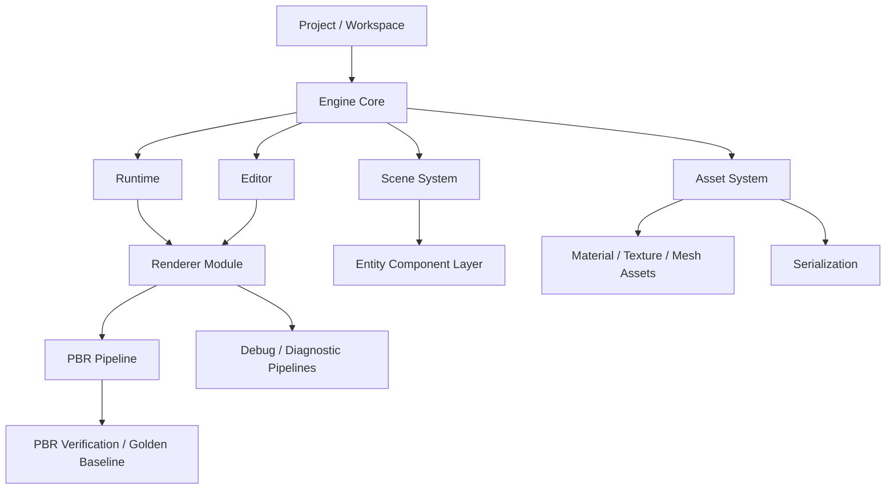

# Engine Roadmap After PBR Foundation

## Positioning

The project has crossed from an OpenGL experiment collection into a small engine rewrite. The renderer is now strong enough to host a basic PBR pipeline, so the next stage should not keep expanding PBR as the project center.

PBR should be treated as one renderer pipeline owned by the engine, not as the engine itself.

## Boundary Decision

Current PBR work is frozen at the foundation level:

- Keep forward PBR, deferred PBR, G-buffer, shadow atlas, tiled light culling, clustered light culling probe, GPU timing, and verification tooling.
- Continue only PBR work that is needed to stabilize the renderer boundary or prevent regressions.
- Do not add advanced rendering features unless they force a necessary engine interface decision.

Examples of deferred PBR work:

- Full glTF material parity.
- Advanced transparency or OIT.
- Production clustered overflow strategy.
- Advanced GI or ray tracing.
- Large-scale real asset performance tuning.

These are renderer product work, not engine foundation work.

## Engine Architecture Target

## Phase 0: PBR Freeze

Goal: make the current PBR renderer safe to keep while engine work starts.

Required outcomes:

- A documented PBR feature boundary.
- Golden verification for real asset and texture-set probes.
- Existing 29-mode PBR verification remains green.
- Profiling report remains available, but does not drive more PBR expansion.
- Tiled deferred path remains the stable fallback.
- Clustered deferred path remains experimental/profiling-oriented until overflow and quality policy are solved.

## Phase 1: Engine Core

Goal: separate engine lifecycle from application-specific experiments.

Main tasks:

- Introduce clear `Engine`, `Runtime`, `Editor`, and `Application` ownership.
- Move global state toward explicit context objects.
- Define module startup/shutdown order.
- Keep OpenGL-specific code inside renderer/platform boundaries.
- Replace ad-hoc experiment flags with engine-level project/runtime configuration.

Success condition:

- A game or editor session can boot without PBR-specific setup controlling the whole application.

## Phase 2: Scene And Entity System

Goal: stop treating scene content as hard-coded setup code.

Main tasks:

- Add entity IDs and a component storage model.
- Move transform, mesh renderer, camera, light, and name/hierarchy into components.
- Define scene load/save boundaries.
- Keep legacy `Object` / `Mesh` classes usable during migration.

Success condition:

- A scene can be described as data and inspected/edited without rewriting setup code.

## Phase 3: Asset And Serialization

Goal: make resources engine-owned instead of path-owned.

Main tasks:

- Add asset IDs and an asset registry.
- Track source path, imported path, type, and runtime handle.
- Define material, mesh, texture, shader, and scene serialization formats.
- Keep Assimp import as an importer, not as the asset system itself.

Success condition:

- A material or model can be referenced by asset ID and reloaded without changing renderer code.

## Phase 4: Editor Foundation

Goal: make the editor operate on engine data.

Main tasks:

- Rebuild hierarchy on entity/scene data.
- Make inspector read/write component schemas.
- Add asset browser as a view of the asset registry.
- Split Scene View and Game View.
- Keep renderer debug panels separate from gameplay/editor state.

Success condition:

- Selecting an entity edits components, not renderer-specific objects directly.

## Phase 5: Runtime Gameplay Layer

Goal: allow scenes to run as game content.

Main tasks:

- Define update phases.
- Add input routing.
- Add script or native behavior attachment points.
- Add camera/controller ownership rules.
- Separate editor-only behavior from runtime behavior.

Success condition:

- A runtime scene can update without depending on editor panels or verification flags.

## Phase 6: Renderer As Engine Module

Goal: make renderer pipelines swappable behind engine-facing interfaces.

Main tasks:

- Define renderable extraction from scene/components.
- Move PBR-specific material binding behind renderer material interfaces.
- Keep pass registry and profile configuration, but make them renderer-internal.
- Add debug views through renderer diagnostics, not engine core.

Success condition:

- PBR, debug, and future pipelines can be selected without changing scene or asset ownership.

## Near-Term Rule

Until Phase 2 starts, any new rendering work must answer one question:

Does this make the engine boundary clearer?

If the answer is no, it should be deferred.
